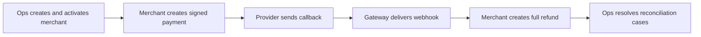

# Mini Payment Gateway

<p align="center">
  <strong>A production-shaped FastAPI payment gateway MVP with merchant auth, payment/refund lifecycles, provider callbacks, durable webhooks, reconciliation, audit logs, and full E2E coverage.</strong>
</p>

<p align="center">
  <a href="docs/getting-started/local-setup.md">Quick Start</a>
  |
  <a href="docs/api/README.md">API Contract</a>
  |
  <a href="docs/architecture/backend.md">Architecture</a>
  |
  <a href="docs/testing/e2e.md">E2E Scenarios</a>
  |
  <a href="docs/getting-started/runbook.md">Runbook</a>
</p>

<p align="center">
  
  
  
  
  
</p>

Mini Payment Gateway is not a toy CRUD demo. It is a compact backend that
models the hard parts of a real payment gateway: signed merchant requests,
stateful payment and refund flows, provider result callbacks, webhook delivery
with retry, manual recovery, reconciliation evidence, and an auditable internal
ops trail.

It is intentionally small enough to read, but complete enough to demonstrate
how money-movement systems are stitched together.

## Scope

- **Merchant-grade request authentication**: HMAC signatures, timestamp checks,
  active credential lookup, and stable auth error codes.
- **Payment lifecycle**: create QR-style payments, query by transaction/order,
  handle duplicate pending requests, expire overdue payments, and reject
  unsafe success duplicates.
- **Refund lifecycle**: full-refund-only MVP flow with idempotent refund IDs,
  refund window checks, callback processing, and final-state protection.
- **Provider callback handling**: normalized callback logs, raw payload
  retention, duplicate safety, and reconciliation when provider evidence
  conflicts with gateway state.
- **Durable webhooks**: final payment/refund events, signed outbound payloads,
  persisted delivery attempts, retry scheduling, exhaustion, and manual retry.
- **Internal ops layer**: merchant onboarding, credential creation/rotation,
  activation, suspension, disabling, reconciliation review, and audit logging.
- **Readable architecture**: thin FastAPI controllers, service-level business
  rules, repository-focused persistence, SQLAlchemy models, Alembic migrations.
- **Demo-ready verification**: route-level E2E coverage plus smoke scripts for
  payment, callback, refund, webhook, and ops reconciliation flows.

## Demo Journey



The main E2E test covers the full route-level story:

```bash
cd backend
python -m unittest tests.test_e2e_payment_refund_webhook -v
```

Covered E2E paths:

- onboarding -> active credential -> payment success -> payment webhook ->
  full refund -> refund webhook;
- duplicate/idempotent payment behavior and bad HMAC rejection;
- late success callback -> reconciliation record -> ops resolution;
- webhook retry exhaustion -> manual retry with audit trail;
- suspended merchant payment/refund rejection.

## Architecture At A Glance

```text
Merchant / Provider / Ops
        |
        v
FastAPI controllers
        |
        v
Services: auth, payment, refund, callbacks, webhooks, reconciliation, ops
        |
        v
Repositories
        |
        v
SQLAlchemy models + PostgreSQL + Alembic
```

Key backend folders:

```text
backend/app/
  controllers/   FastAPI routes and dependencies
  schemas/       request/response contracts
  services/      business rules and workflow orchestration
  repositories/  focused SQLAlchemy persistence helpers
  models/        SQLAlchemy entities and enums
  core/          errors, security, config, time helpers
  db/            session and database wiring
```

Read more in [docs/architecture/backend.md](docs/architecture/backend.md).

## Quick Start

Prerequisites:

- Docker Desktop
- PostgreSQL via `docker compose`
- Python 3.13 or a compatible Python executable available as:
  `python`

Start the backend:

```bash
docker compose up -d postgres
cd backend
python -m pip install -e .
python -m alembic upgrade head
python -m uvicorn app.main:app --host 127.0.0.1 --port 8000
```

Then open:

- Health: `http://127.0.0.1:8000/health`
- OpenAPI UI: `http://127.0.0.1:8000/docs`

Detailed setup lives in
[docs/getting-started/local-setup.md](docs/getting-started/local-setup.md).

## Verification

Run the full test suite:

```bash
cd backend
python -m unittest discover tests -v
```

Run the E2E gateway journey:

```bash
cd backend
python -m unittest tests.test_e2e_payment_refund_webhook -v
```

Run smoke demos:

```bash
cd backend
python scripts/smoke_payment_api.py
python scripts/smoke_provider_callback_api.py
python scripts/smoke_refund_api.py
python scripts/smoke_webhook_api.py
python scripts/smoke_ops_reconciliation_api.py
```

## Documentation Map

| Reader goal | Start here |
| --- | --- |
| Run the project locally | [docs/getting-started/local-setup.md](docs/getting-started/local-setup.md) |
| Demo the full MVP | [docs/getting-started/runbook.md](docs/getting-started/runbook.md) |
| Understand backend design | [docs/architecture/backend.md](docs/architecture/backend.md) |
| Review API contracts | [docs/api/README.md](docs/api/README.md) |
| Understand scenarios and coverage | [docs/testing/README.md](docs/testing/README.md) |
| Operate merchant onboarding/webhook/reconciliation flows | [docs/operations/README.md](docs/operations/README.md) |
| Read product and business context | [docs/product/README.md](docs/product/README.md) |
| Inspect implementation history | [docs/history/README.md](docs/history/README.md) |

## Project Status

MVP scope is complete through phase 08:

- API contract and backend foundation
- Merchant HMAC auth and readiness checks
- Payment core
- Provider callbacks and expiration
- Refund core
- Webhook delivery and retry
- Ops onboarding, credentials, reconciliation, and audit
- Readiness docs and route-level E2E coverage

Intentionally out of scope for this MVP:

- production internal auth/JWT/RBAC for ops users;
- settlement, ledger posting, disputes, analytics, and multi-provider routing;
- partial refunds;
- merchant self-service UI.
