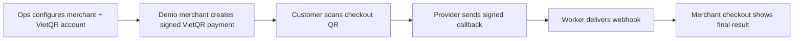

# Mini Payment Gateway

<p align="center">
  <strong>A pilot-ready FastAPI payment gateway with merchant auth, VietQR payment creation, signed provider callbacks, worker automation, durable webhooks, reconciliation, audit logs, and full E2E coverage.</strong>
</p>

<p align="center">
  <a href="docs/getting-started/local-setup.md">Quick Start</a>
  |
  <a href="docs/api/README.md">API Contract</a>
  |
  <a href="docs/architecture/backend.md">Architecture</a>
  |
  <a href="docs/testing/e2e.md">E2E Scenarios</a>
  |
  <a href="docs/getting-started/runbook.md">Runbook</a>
  |
  <a href="docs/getting-started/e2e-payment-demo.md">Visual E2E Demo</a>
</p>

<p align="center">
  
  
  
  
  
</p>

Mini Payment Gateway is not a toy CRUD demo. It is a compact backend that
models the hard parts of a real payment gateway: signed merchant requests,
stateful payment and refund flows, provider result callbacks, webhook delivery
with retry, manual recovery, reconciliation evidence, and an auditable internal
ops trail.

It is intentionally small enough to read, but complete enough to demonstrate
how money-movement systems are stitched together.

## Scope

- **Merchant-grade request authentication**: HMAC signatures, timestamp checks,
  active credential lookup, and stable auth error codes.
- **Payment lifecycle**: create Ops-configured VietQR payments, query by
  transaction/order, handle duplicate pending requests, expire overdue payments,
  and reject unsafe success duplicates.
- **Refund lifecycle**: full-refund-only MVP flow with idempotent refund IDs,
  refund window checks, callback processing, and final-state protection.
- **Provider callback handling**: signed provider/simulator HMAC, normalized
  callback logs, raw payload retention, duplicate safety, and reconciliation
  when provider evidence conflicts with gateway state.
- **Durable webhooks**: final payment/refund events, signed outbound payloads,
  persisted delivery attempts, retry scheduling, exhaustion, and manual retry.
- **Background worker**: automatic overdue payment expiration and due webhook
  retry delivery with PostgreSQL advisory locks.
- **Internal ops layer**: merchant onboarding, credential creation/rotation,
  activation, suspension, disabling, reconciliation review, merchant portal
  user provisioning, and audit logging.
- **Dashboard surfaces**: an internal Ops Dashboard and a separate read-only
  Merchant Dashboard with merchant-scoped session auth.
- **Readable architecture**: thin FastAPI controllers, service-level business
  rules, repository-focused persistence, SQLAlchemy models, Alembic migrations.
- **Demo-ready verification**: route-level E2E coverage plus smoke scripts for
  payment, callback, refund, webhook, and ops reconciliation flows.
- **Visible merchant checkout**: a separate local demo merchant backend signs
  payment requests, displays VietQR, verifies gateway webhooks, and updates its
  checkout only after a valid webhook arrives.

## Demo Journey



The main E2E test covers the full route-level story:

```bash
cd backend
python -m unittest tests.test_e2e_payment_refund_webhook -v
```

Covered E2E paths:

- onboarding -> active credential -> payment success -> payment webhook ->
  full refund -> refund webhook;
- duplicate/idempotent payment behavior and bad HMAC rejection;
- late success callback -> reconciliation record -> ops resolution;
- webhook retry exhaustion -> manual retry with audit trail;
- suspended merchant payment/refund rejection.

## Architecture At A Glance

```text
Merchant / Provider / Ops
        |
        v
FastAPI controllers
        |
        v
Services: auth, payment, refund, callbacks, webhooks, reconciliation, ops
        |
        v
Repositories
        |
        v
SQLAlchemy models + PostgreSQL + Alembic
```

Key backend folders:

```text
backend/app/
  controllers/   FastAPI routes and dependencies
  schemas/       request/response contracts
  services/      business rules and workflow orchestration
  repositories/  focused SQLAlchemy persistence helpers
  models/        SQLAlchemy entities and enums
  worker/        expiration and webhook delivery automation
  core/          errors, security, config, time helpers
  db/            session and database wiring
```

Read more in [docs/architecture/backend.md](docs/architecture/backend.md).

## Dashboards

The repository has two React/Vite dashboard apps:

- `apps/ops-dashboard/`: internal operations dashboard on port `4173`.
- `apps/merchant-dashboard/`: merchant-facing read-only portal on port `4174`.

Ops includes internal login/bootstrap for `ADMIN` and `OPS`, operational
explorers, merchant lifecycle actions, reconciliation workflows, audit logs,
Admin-only internal user management, and merchant portal user provisioning for
both internal roles.

Merchant Dashboard includes merchant session auth, overview metrics, payment,
refund, and webhook explorers, profile metadata, credential metadata, and local
password change. Its Analytics page gives merchant-scoped revenue, payment
status, refund, webhook health, and attention-breakdown charts. It never exposes
raw credential secrets.

The separate `backend/demo_merchant/` FastAPI app runs on port `8100` for the
visual payment demonstration. It is a local merchant integration example, not
a new gateway-hosted checkout or Docker service.

Run them locally like this:

```bash
npm install
npm run ops-dashboard:dev
npm run merchant-dashboard:dev
```

In local dev, both Vite apps proxy `/api` to `http://127.0.0.1:8000`, so the
frontends and backend share the same session flow as the sandbox deployment.

Seed dashboard demo data explicitly when you want a local/sandbox walkthrough:

```bash
cd backend
python scripts/seed_dashboard_demo.py
```

## Quick Start

Prerequisites:

- Docker Desktop
- PostgreSQL via `docker compose`
- Python 3.13 or a compatible Python executable available as:
  `python`

Start the backend:

```bash
docker compose up -d postgres
cd backend
python -m pip install -e .
python -m alembic upgrade head
python -m uvicorn app.main:app --host 127.0.0.1 --port 8000
```

Start the worker in another terminal:

```bash
cd backend
python -m app.worker.main
```

Start the visual demo merchant in another terminal when demonstrating the
customer checkout:

```bash
cd backend
python -m uvicorn demo_merchant.main:app --host 127.0.0.1 --port 8100
```

Then open:

- Health: `http://127.0.0.1:8000/health`
- OpenAPI UI: `http://127.0.0.1:8000/docs`
- Ops dashboard: `http://127.0.0.1:4173`
- Merchant dashboard: `http://127.0.0.1:4174`
- Demo merchant checkout: `http://127.0.0.1:8100`

Detailed setup lives in
[docs/getting-started/local-setup.md](docs/getting-started/local-setup.md).

## Verification

Run the full test suite:

```bash
cd backend
python -m unittest discover tests -v
```

Run the E2E gateway journey:

```bash
cd backend
python -m unittest tests.test_e2e_payment_refund_webhook -v
```

Run smoke demos:

```bash
cd backend
python scripts/smoke_payment_api.py
python scripts/smoke_provider_callback_api.py
python scripts/smoke_refund_api.py
python scripts/smoke_webhook_api.py
python scripts/smoke_ops_reconciliation_api.py
python scripts/smoke_e2e_demo.py --outcome success
python scripts/smoke_e2e_demo.py --outcome failed
```

## Documentation Map

| Reader goal | Start here |
| --- | --- |
| Run the project locally | [docs/getting-started/local-setup.md](docs/getting-started/local-setup.md) |
| Demo the full MVP | [docs/getting-started/runbook.md](docs/getting-started/runbook.md) |
| Demo the VietQR pilot to an instructor | [docs/getting-started/vietqr-pilot-demo.md](docs/getting-started/vietqr-pilot-demo.md) |
| Demo the complete visible payment journey | [docs/getting-started/e2e-payment-demo.md](docs/getting-started/e2e-payment-demo.md) |
| Understand internal DevOps design | [docs/infrastructure/devops-architecture.md](docs/infrastructure/devops-architecture.md) |
| Build a new sandbox host from zero | [docs/infrastructure/sandbox-setup-from-zero.md](docs/infrastructure/sandbox-setup-from-zero.md) |
| Deploy to the sandbox host | [docs/infrastructure/sandbox-deployment.md](docs/infrastructure/sandbox-deployment.md) |
| Understand backend design | [docs/architecture/backend.md](docs/architecture/backend.md) |
| Review API contracts | [docs/api/README.md](docs/api/README.md) |
| Understand scenarios and coverage | [docs/testing/README.md](docs/testing/README.md) |
| Operate merchant onboarding/webhook/reconciliation flows | [docs/service-operations/README.md](docs/service-operations/README.md) |
| Read product and business context | [docs/product/README.md](docs/product/README.md) |
| Inspect implementation history | [docs/history/README.md](docs/history/README.md) |

## Project Status

Current scope is a pilot-ready API-only gateway with a separate visual demo
merchant integration:

- API contract and backend foundation
- Merchant HMAC auth and readiness checks
- Payment core with Ops-managed VietQR receiving accounts
- Signed provider callbacks and expiration
- Refund core
- Webhook delivery and retry
- Worker automation for expiration and due webhook delivery
- Ops onboarding, credentials, reconciliation, and audit
- Readiness docs and route-level E2E coverage
- Sandbox CI/CD
- Internal auth, RBAC, and Ops dashboard UI
- Merchant Dashboard backend/session APIs, frontend UI, Ops provisioning, and
  explicit demo seeding
- Local demo merchant checkout for payment creation, bank callback simulation,
  verified webhook receipt, and visible final status

Intentionally out of scope for this MVP:

- hosted checkout, settlement, ledger posting, disputes, advanced BI exports,
  and multi-provider routing;
- partial refunds;
- merchant self-service mutation workflows beyond password change.
