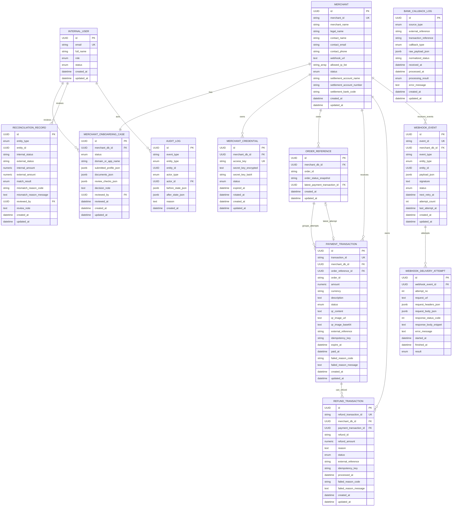

# Models Entity Diagram

This directory contains the core SQLAlchemy models for the mini payment gateway.
The diagram focuses on MVP entities and the relationships needed for merchant
onboarding, QR payments, refunds, webhook delivery, reconciliation, and audit.

## Important DB Invariants

- `merchants.merchant_id` is unique and is the public merchant identifier.
- `merchant_credentials` allows only one `ACTIVE` credential per merchant.
- `merchant_onboarding_cases` allows one onboarding case per merchant in the MVP.
- `order_references` is unique by `merchant_db_id + order_id`.
- `payment_transactions` allows one active `PENDING` payment per `merchant_db_id + order_id`.
- `refund_transactions` is unique by `merchant_db_id + refund_id`.
- `refund_transactions` allows at most one `REFUNDED` row per payment.
- Payment and refund amounts must be positive.
- `webhook_events.attempt_count` must be non-negative.

## Logical References

`AuditLog`, `WebhookEvent`, and `ReconciliationRecord` use `entity_type + entity_id`
to point at business entities. Those references are polymorphic by design, so they
are validated by service logic rather than by a direct database foreign key.

`BankCallbackLog` stores raw provider evidence and references gateway objects by
provider or gateway reference strings instead of strict foreign keys.
