# Models Entity Diagram

This directory contains the core SQLAlchemy models for the mini payment gateway.
The diagram focuses on MVP entities and the relationships needed for merchant
onboarding, QR payments, refunds, webhook delivery, reconciliation, and audit.

```plantuml
@startuml models_entity_diagram
hide circle
skinparam classAttributeIconSize 0
skinparam nodesep 80
skinparam ranksep 80

entity "internal_users" as INTERNAL_USER {
  * id : UUID <<PK>>
  --
  email : string <<UK>>
  full_name : string
  role : enum
  status : enum
  created_at : datetime
  updated_at : datetime
}

entity "merchants" as MERCHANT {
  * id : UUID <<PK>>
  --
  merchant_id : string <<UK>>
  merchant_name : string
  legal_name : string
  contact_name : string
  contact_email : string
  contact_phone : string
  webhook_url : text
  allowed_ip_list : string[]
  status : enum
  settlement_account_name : string
  settlement_account_number : string
  settlement_bank_code : string
  created_at : datetime
  updated_at : datetime
}

entity "merchant_onboarding_cases" as MERCHANT_ONBOARDING_CASE {
  * id : UUID <<PK>>
  --
  merchant_db_id : UUID <<FK>>
  status : enum
  domain_or_app_name : string
  submitted_profile_json : jsonb
  documents_json : jsonb
  review_checks_json : jsonb
  decision_note : text
  reviewed_by : UUID <<FK>>
  reviewed_at : datetime
  created_at : datetime
  updated_at : datetime
}

entity "merchant_credentials" as MERCHANT_CREDENTIAL {
  * id : UUID <<PK>>
  --
  merchant_db_id : UUID <<FK>>
  access_key : string <<UK>>
  secret_key_encrypted : text
  secret_key_last4 : string
  status : enum
  expired_at : datetime
  rotated_at : datetime
  created_at : datetime
  updated_at : datetime
}

entity "order_references" as ORDER_REFERENCE {
  * id : UUID <<PK>>
  --
  merchant_db_id : UUID <<FK>>
  order_id : string
  order_status_snapshot : string
  latest_payment_transaction_id : UUID <<FK>>
  created_at : datetime
  updated_at : datetime
}

entity "payment_transactions" as PAYMENT_TRANSACTION {
  * id : UUID <<PK>>
  --
  transaction_id : string <<UK>>
  merchant_db_id : UUID <<FK>>
  order_reference_id : UUID <<FK>>
  order_id : string
  amount : numeric
  currency : string
  description : text
  status : enum
  qr_content : text
  qr_image_url : text
  qr_image_base64 : text
  external_reference : string
  idempotency_key : string
  expire_at : datetime
  paid_at : datetime
  failed_reason_code : string
  failed_reason_message : text
  created_at : datetime
  updated_at : datetime
}

entity "refund_transactions" as REFUND_TRANSACTION {
  * id : UUID <<PK>>
  --
  refund_transaction_id : string <<UK>>
  merchant_db_id : UUID <<FK>>
  payment_transaction_id : UUID <<FK>>
  refund_id : string
  refund_amount : numeric
  reason : text
  status : enum
  external_reference : string
  idempotency_key : string
  processed_at : datetime
  failed_reason_code : string
  failed_reason_message : text
  created_at : datetime
  updated_at : datetime
}

entity "webhook_events" as WEBHOOK_EVENT {
  * id : UUID <<PK>>
  --
  event_id : string <<UK>>
  merchant_db_id : UUID <<FK>>
  event_type : string
  entity_type : enum
  entity_id : UUID
  payload_json : jsonb
  signature : text
  status : enum
  next_retry_at : datetime
  attempt_count : int
  last_attempt_at : datetime
  created_at : datetime
  updated_at : datetime
}

entity "webhook_delivery_attempts" as WEBHOOK_DELIVERY_ATTEMPT {
  * id : UUID <<PK>>
  --
  webhook_event_id : UUID <<FK>>
  attempt_no : int
  request_url : text
  request_headers_json : jsonb
  request_body_json : jsonb
  response_status_code : int
  response_body_snippet : text
  error_message : text
  started_at : datetime
  finished_at : datetime
  result : enum
}

entity "bank_callback_logs" as BANK_CALLBACK_LOG {
  * id : UUID <<PK>>
  --
  source_type : enum
  external_reference : string
  transaction_reference : string
  callback_type : enum
  raw_payload_json : jsonb
  normalized_status : string
  received_at : datetime
  processed_at : datetime
  processing_result : enum
  error_message : text
  created_at : datetime
  updated_at : datetime
}

entity "reconciliation_records" as RECONCILIATION_RECORD {
  * id : UUID <<PK>>
  --
  entity_type : enum
  entity_id : UUID
  internal_status : string
  external_status : string
  internal_amount : numeric
  external_amount : numeric
  match_result : enum
  mismatch_reason_code : string
  mismatch_reason_message : text
  reviewed_by : UUID <<FK>>
  review_note : text
  created_at : datetime
  updated_at : datetime
}

entity "audit_logs" as AUDIT_LOG {
  * id : UUID <<PK>>
  --
  event_type : string
  entity_type : enum
  entity_id : UUID
  actor_type : enum
  actor_id : UUID <<FK>>
  before_state_json : jsonb
  after_state_json : jsonb
  reason : text
  created_at : datetime
}

MERCHANT "1" -down- "0..1" MERCHANT_ONBOARDING_CASE
MERCHANT "1" -down- "0..*" MERCHANT_CREDENTIAL
MERCHANT "1" -right- "0..*" ORDER_REFERENCE
MERCHANT "1" -right- "0..*" PAYMENT_TRANSACTION
MERCHANT "1" -right- "0..*" REFUND_TRANSACTION
MERCHANT "1" -right- "0..*" WEBHOOK_EVENT

INTERNAL_USER "1" -down- "0..*" MERCHANT_ONBOARDING_CASE
INTERNAL_USER "1" -right- "0..*" RECONCILIATION_RECORD
INTERNAL_USER "1" -right- "0..*" AUDIT_LOG

ORDER_REFERENCE "1" -right- "0..*" PAYMENT_TRANSACTION
ORDER_REFERENCE "0..1" ..> "0..1" PAYMENT_TRANSACTION
PAYMENT_TRANSACTION "1" -right- "0..*" REFUND_TRANSACTION

WEBHOOK_EVENT "1" -down- "0..*" WEBHOOK_DELIVERY_ATTEMPT
@enduml
```

## Relationship Notes

The PlantUML diagram intentionally keeps relation labels out of the drawing so
the lines do not overlap or obscure each other. This table carries the semantic
meaning of each relation.

| From | To | Cardinality | Meaning |
| --- | --- | --- | --- |
| `MERCHANT` | `MERCHANT_ONBOARDING_CASE` | `1 -> 0..1` | Merchant has one onboarding case in the MVP. |
| `MERCHANT` | `MERCHANT_CREDENTIAL` | `1 -> 0..*` | Merchant owns API credentials. |
| `MERCHANT` | `ORDER_REFERENCE` | `1 -> 0..*` | Merchant owns order references. |
| `MERCHANT` | `PAYMENT_TRANSACTION` | `1 -> 0..*` | Merchant receives payment transactions. |
| `MERCHANT` | `REFUND_TRANSACTION` | `1 -> 0..*` | Merchant owns refund transactions. |
| `MERCHANT` | `WEBHOOK_EVENT` | `1 -> 0..*` | Merchant receives webhook events. |
| `INTERNAL_USER` | `MERCHANT_ONBOARDING_CASE` | `1 -> 0..*` | Internal user reviews onboarding cases. |
| `INTERNAL_USER` | `RECONCILIATION_RECORD` | `1 -> 0..*` | Internal user reviews reconciliation records. |
| `INTERNAL_USER` | `AUDIT_LOG` | `1 -> 0..*` | Internal user acts as an audit actor. |
| `ORDER_REFERENCE` | `PAYMENT_TRANSACTION` | `1 -> 0..*` | Order reference groups payment attempts. |
| `ORDER_REFERENCE` | `PAYMENT_TRANSACTION` | `0..1 -> 0..1` | Order reference points to the latest payment attempt. |
| `PAYMENT_TRANSACTION` | `REFUND_TRANSACTION` | `1 -> 0..*` | Payment transaction can have refund attempts. |
| `WEBHOOK_EVENT` | `WEBHOOK_DELIVERY_ATTEMPT` | `1 -> 0..*` | Webhook event records delivery attempts. |

## Important DB Invariants

- `merchants.merchant_id` is unique and is the public merchant identifier.
- `merchant_credentials` allows only one `ACTIVE` credential per merchant.
- `merchant_onboarding_cases` allows one onboarding case per merchant in the MVP.
- `order_references` is unique by `merchant_db_id + order_id`.
- `payment_transactions` allows one active `PENDING` payment per `merchant_db_id + order_id`.
- `refund_transactions` is unique by `merchant_db_id + refund_id`.
- `refund_transactions` allows at most one `REFUNDED` row per payment.
- Payment and refund amounts must be positive.
- `webhook_events.attempt_count` must be non-negative.

## Logical References

`AuditLog`, `WebhookEvent`, and `ReconciliationRecord` use `entity_type + entity_id`
to point at business entities. Those references are polymorphic by design, so they
are validated by service logic rather than by a direct database foreign key.

`BankCallbackLog` stores raw provider evidence and references gateway objects by
provider or gateway reference strings instead of strict foreign keys.
