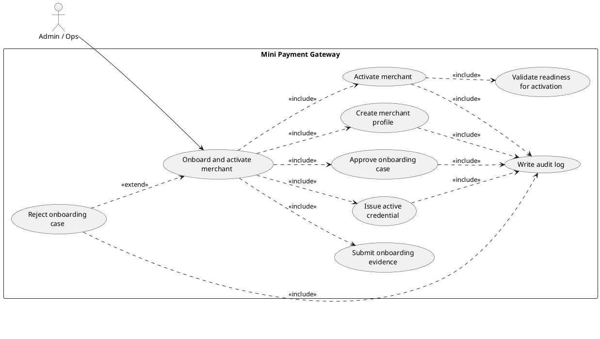
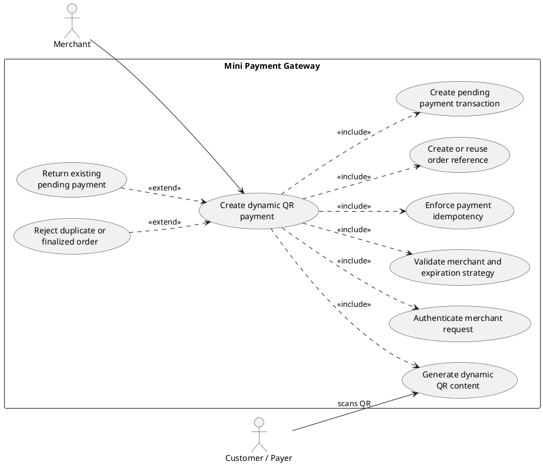
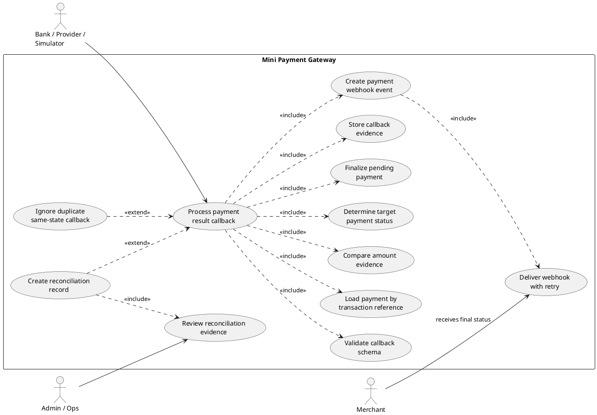
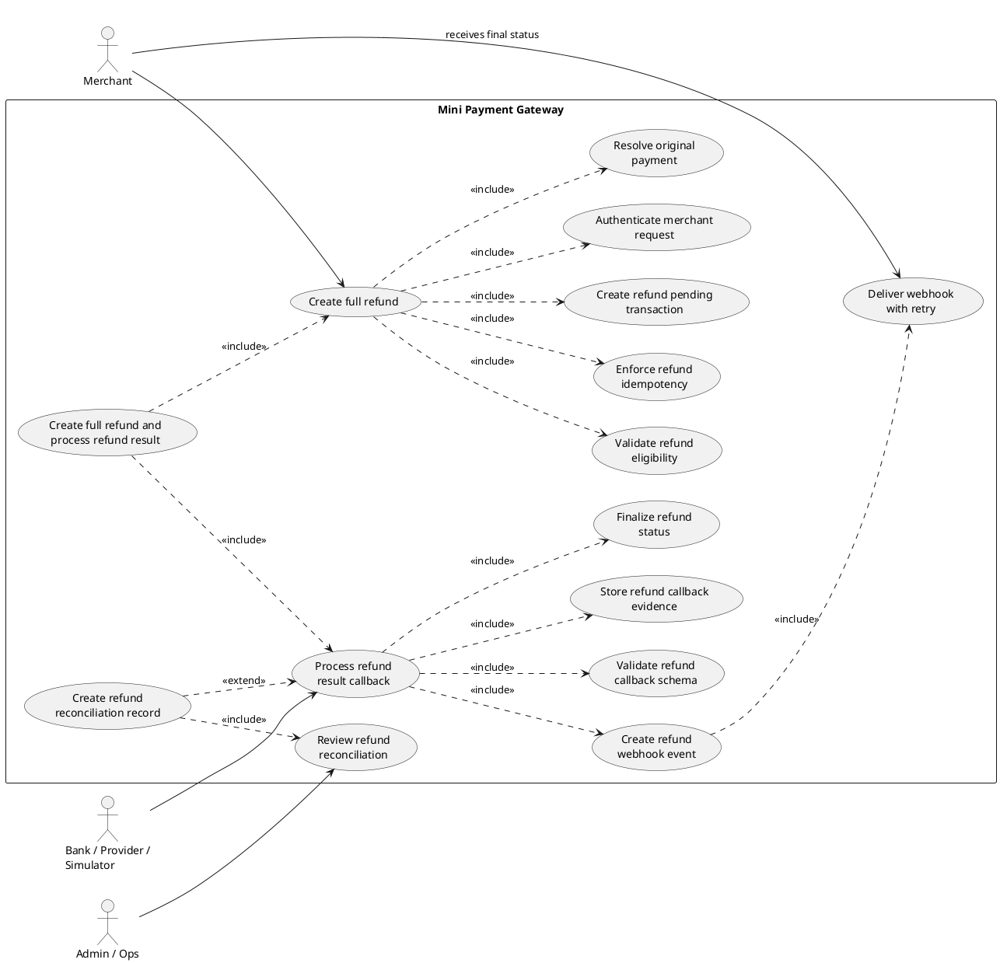
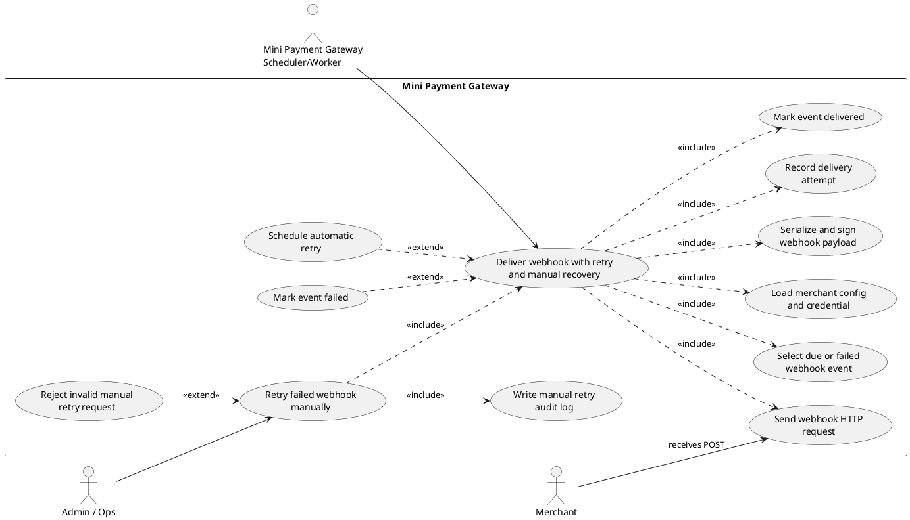

# Core Use Case Specifications

This document selects the five most important use cases for the mini payment
gateway and describes them using `docs/7_usecase_template.md`.

Selection criteria:

- the use case is required for end-to-end payment gateway operation;
- the use case touches core money movement or merchant integration;
- the use case keeps the system operable and traceable in the MVP.

The five selected use cases are:

- UC001 - Onboard and activate merchant
- UC002 - Create dynamic QR payment
- UC003 - Process payment result callback
- UC004 - Create full refund and process refund result
- UC005 - Deliver webhook with retry and manual recovery

Each use case includes a PlantUML diagram in a `plantuml` fence. Rendering
depends on the Markdown viewer or IDE PlantUML plugin.

---

# Use Case "Onboard and activate merchant"

## 1. Use case code

UC001

## 2. Brief Description

This use case describes the interaction between `Admin/Ops` and
`Mini Payment Gateway` when `Admin/Ops` wishes to create a merchant, submit and
approve onboarding evidence, issue an active credential, and activate the
merchant for payment/refund APIs.

## 3. Use case diagram

## 4. Actors

### 4.1 Admin/Ops

Internal operator who manages merchant records, onboarding decisions, and
credentials.

## 5. Preconditions

- Database migrations have been applied.
- Internal ops access is allowed for the MVP environment.
- The target `merchant_id` does not already exist.
- Admin/Ops has enough onboarding information to create the merchant profile.

## 6. Basic Flow of Events

1. Admin/Ops submits merchant profile data to create a merchant.
2. The software validates that the public `merchant_id` is unique.
3. The software creates the merchant with status `PENDING_REVIEW`.
4. Admin/Ops submits onboarding profile, document metadata, review checks, and
   integration configuration.
5. The software creates or updates the merchant onboarding case and sets it to
   `PENDING_REVIEW`.
6. Admin/Ops approves the onboarding case with reviewer and decision note.
7. The software stores the approval, reviewer, decision note, and review time.
8. Admin/Ops creates an active merchant credential.
9. The software stores the active credential and masked last four characters of
   the secret.
10. Admin/Ops activates the merchant.
11. The software verifies that onboarding is approved and an active credential
    exists.
12. The software updates the merchant status to `ACTIVE`.
13. The software writes audit logs for merchant creation, onboarding approval,
    credential creation, and activation.

## 7. Alternative flows

**Table 1 - Alternative flows of events for UC001**

| No | Location | Condition | Action | Resume location |
|---:|---|---|---|---|
| 1 | At Step 2 | `merchant_id` already exists | The software rejects the request with `MERCHANT_ALREADY_EXISTS`. | Use case ends |
| 2 | At Step 5 | An onboarding case already exists and is not final | The software updates the existing case instead of creating a duplicate. | Resumes at Step 6 |
| 3 | At Step 5 | Onboarding case is already `APPROVED` or `REJECTED` | The software rejects the update with `ONBOARDING_CASE_FINAL`. | Use case ends |
| 4 | At Step 6 | Admin/Ops rejects the onboarding case | The software sets the case to `REJECTED`, writes audit, and keeps the merchant non-active. | Use case ends |
| 5 | At Step 9 | Active credential already exists | The software rejects credential creation with `ACTIVE_CREDENTIAL_EXISTS`. | Use case ends |
| 6 | At Step 11 | Onboarding is not `APPROVED` | The software rejects activation with `ONBOARDING_CASE_NOT_APPROVED`. | Use case ends |
| 7 | At Step 11 | No active credential exists | The software rejects activation with `ACTIVE_CREDENTIAL_REQUIRED`. | Use case ends |

## 8. Input data

**Table A - Input data of merchant onboarding and activation**

| No | Data fields | Description | Mandatory | Valid condition | Example |
|---:|---|---|---|---|---|
| 1 | `merchant_id` | Public merchant identifier used in APIs | Yes | Unique, 1-64 characters | `m_demo` |
| 2 | `merchant_name` | Display name | Yes | 1-255 characters | `Demo Merchant` |
| 3 | `contact_email` | Merchant contact email | Yes | Valid email-like string | `ops@example.com` |
| 4 | `webhook_url` | Merchant webhook endpoint | No | URL string when present | `https://merchant.example.com/webhook` |
| 5 | `submitted_profile_json` | Business profile snapshot | Yes | JSON object | `{"business_type":"online_shop"}` |
| 6 | `documents_json` | Submitted document metadata | Yes | JSON object | `{"license":"demo.pdf"}` |
| 7 | `review_checks_json` | Reviewer checks and risk data | No | JSON object | `{"risk_level":"LOW"}` |
| 8 | `decision_note` | Approval or rejection note | Yes for decision | Non-empty text | `Documents verified.` |
| 9 | `access_key` | Merchant credential public key | Yes for credential | Unique string | `ak_demo` |
| 10 | `secret_key` | Merchant credential secret | Yes for credential | Non-empty string | `super-secret` |
| 11 | `actor_type` | Audit actor type | Yes | `ADMIN` or `OPS` | `OPS` |
| 12 | `reason` | Audit reason | No | Text | `Onboarding approved.` |

## 9. Output data

**Table B - Output data of merchant onboarding and activation**

| No | Data fields | Description | Display format | Example |
|---:|---|---|---|---|
| 1 | `merchant_id` | Public merchant identifier | String | `m_demo` |
| 2 | `status` | Merchant operational status | Enum string | `ACTIVE` |
| 3 | `case_id` | Internal onboarding case id | UUID string | `9e2f...` |
| 4 | `onboarding_status` | Onboarding case status | Enum string | `APPROVED` |
| 5 | `reviewed_at` | Decision timestamp | ISO-8601 UTC | `2026-04-29T10:00:00Z` |
| 6 | `access_key` | Public access key | String | `ak_demo` |
| 7 | `secret_key_last4` | Masked credential suffix | String | `cret` |

## 10. Postconditions

- Merchant exists and is `ACTIVE`.
- Exactly one active credential exists for the merchant.
- Onboarding approval is traceable through the onboarding case.
- Audit logs exist for the administrative actions.
- The merchant can call payment and refund APIs with valid HMAC credentials.

---

# Use Case "Create dynamic QR payment"

## 1. Use case code

UC002

## 2. Brief Description

This use case describes the interaction between `Merchant`,
`Customer/Payer`, and `Mini Payment Gateway` when the merchant wishes to create a
dynamic QR payment and let the customer pay through a banking application.

## 3. Use case diagram

## 4. Actors

### 4.1 Merchant

Merchant-owned system that calls gateway APIs with HMAC authentication.

### 4.2 Customer/Payer

End user who scans the generated QR code and pays outside the gateway.

## 5. Preconditions

- Merchant is `ACTIVE`.
- Merchant has exactly one active credential.
- Merchant request contains valid HMAC headers.
- Request contains exactly one expiration strategy: `expire_at` or
  `ttl_seconds`.

## 6. Basic Flow of Events

1. Merchant sends `POST /v1/payments` with payment request data.
2. The software authenticates the merchant signature and active credential.
3. The software verifies that the merchant is allowed to create payments.
4. The software checks existing payments for the same merchant and `order_id`.
5. The software creates or reuses the order reference.
6. The software creates a `PENDING` payment transaction.
7. The software generates QR content containing merchant, transaction, amount,
   and currency identity.
8. The software returns payment details and QR content.
9. Customer/Payer scans the QR content in a banking application.
10. Payment completion is reported later through UC003.

## 7. Alternative flows

**Table 2 - Alternative flows of events for UC002**

| No | Location | Condition | Action | Resume location |
|---:|---|---|---|---|
| 1 | At Step 2 | Missing or invalid auth header | The software rejects the request with an auth error. | Use case ends |
| 2 | At Step 3 | Merchant is not `ACTIVE` | The software rejects the request with `MERCHANT_NOT_ACTIVE`. | Use case ends |
| 3 | At Step 4 | Identical pending payment already exists | The software returns the existing pending transaction. | Resumes at Step 8 |
| 4 | At Step 4 | Different pending payment exists for the same order | The software rejects the request with `PAYMENT_PENDING_EXISTS`. | Use case ends |
| 5 | At Step 4 | Successful payment already exists for the same order | The software rejects the request with `PAYMENT_ALREADY_SUCCESS`. | Use case ends |
| 6 | At Step 4 | Previous payment is `FAILED` or `EXPIRED` | The software allows a new payment attempt. | Resumes at Step 5 |
| 7 | At Step 1 | Expiration data is invalid | The software rejects the request during schema validation. | Use case ends |

## 8. Input data

**Table A - Input data of payment creation**

| No | Data fields | Description | Mandatory | Valid condition | Example |
|---:|---|---|---|---|---|
| 1 | `X-Merchant-Id` | Public merchant id | Yes | Existing merchant | `m_demo` |
| 2 | `X-Access-Key` | Active access key | Yes | Active credential | `ak_demo` |
| 3 | `X-Timestamp` | Request timestamp | Yes | Within allowed window | `2026-04-29T10:00:00Z` |
| 4 | `X-Signature` | HMAC signature | Yes | Matches canonical string | `a1b2...` |
| 5 | `order_id` | Merchant order id | Yes | 1-128 characters | `ORDER-1001` |
| 6 | `amount` | Payment amount | Yes | Greater than 0 | `100000.00` |
| 7 | `currency` | Currency code | No | 3 characters | `VND` |
| 8 | `description` | Payment description | Yes | Non-empty text | `Demo QR payment` |
| 9 | `expire_at` | Absolute expiration time | Conditional | ISO-8601 datetime | `2026-04-29T10:15:00Z` |
| 10 | `ttl_seconds` | Relative expiration duration | Conditional | Positive integer | `900` |
| 11 | `metadata` | Merchant metadata | No | JSON object | `{"cart_id":"CART-1"}` |

## 9. Output data

**Table B - Output data of payment creation**

| No | Data fields | Description | Display format | Example |
|---:|---|---|---|---|
| 1 | `transaction_id` | Gateway payment identifier | String | `pay_abc123` |
| 2 | `order_id` | Merchant order id | String | `ORDER-1001` |
| 3 | `merchant_id` | Public merchant id | String | `m_demo` |
| 4 | `qr_content` | Dynamic QR payload | String | `MINI_GATEWAY|m_demo|pay_...` |
| 5 | `status` | Payment status | Enum string | `PENDING` |
| 6 | `expire_at` | Expiration time | ISO-8601 datetime | `2026-04-29T10:15:00Z` |

## 10. Postconditions

- A `PENDING` payment exists or an identical pending payment was returned.
- The order reference points to the latest payment attempt.
- Customer/Payer has QR content that can be paid through the external banking
  application.

---

# Use Case "Process payment result callback"

## 1. Use case code

UC003

## 2. Brief Description

This use case describes the interaction between `Bank/Provider/Simulator`,
`Mini Payment Gateway`, and `Merchant` when the provider reports a
payment result and the gateway must finalize payment state, store evidence, and
queue merchant notification.

## 3. Use case diagram

## 4. Actors

### 4.1 Bank/Provider/Simulator

External or simulated provider that sends payment result evidence.

### 4.2 Merchant

Merchant system that later receives the payment webhook and can query payment
status.

### 4.3 Admin/Ops

Internal operator who later reviews reconciliation records for ambiguous
callbacks.

## 5. Preconditions

- A payment transaction may exist with the provider transaction reference.
- Provider callback endpoint is reachable.
- Callback payload includes normalized status and amount evidence.
- Provider traffic is trusted in the MVP environment.

## 6. Basic Flow of Events

1. Bank/Provider/Simulator sends `POST /v1/provider/callbacks/payment`.
2. The software validates callback schema.
3. The software loads the payment by `transaction_reference`.
4. The software compares callback amount with internal payment amount.
5. The software determines the target payment status from callback status.
6. The software updates a `PENDING` payment to `SUCCESS` or `FAILED`.
7. The software stores raw and normalized callback evidence.
8. The software creates a webhook event for the final payment state when the
   merchant has `webhook_url`.
9. The software returns callback processing result.
10. Merchant receives final status later through webhook delivery or
    status query.

## 7. Alternative flows

**Table 3 - Alternative flows of events for UC003**

| No | Location | Condition | Action | Resume location |
|---:|---|---|---|---|
| 1 | At Step 2 | Callback status is unsupported | The software rejects the request during schema validation. | Use case ends |
| 2 | At Step 3 | Payment is not found | The software logs callback evidence as `PENDING_REVIEW` and returns controlled response. | Use case ends |
| 3 | At Step 4 | Callback amount differs from internal amount | The software creates a reconciliation record and does not mark payment success. | Use case ends |
| 4 | At Step 5 | Payment already has the same final state | The software logs callback as `IGNORED` and returns current state. | Use case ends |
| 5 | At Step 5 | Callback conflicts with existing final state | The software creates reconciliation evidence and does not mutate payment. | Use case ends |
| 6 | At Step 5 | Expired payment receives late success | The software keeps payment `EXPIRED` and creates `PENDING_REVIEW` reconciliation evidence. | Use case ends |
| 7 | At Step 8 | Merchant has no `webhook_url` | The software finalizes payment without creating webhook event. | Resumes at Step 9 |

## 8. Input data

**Table A - Input data of payment result callback**

| No | Data fields | Description | Mandatory | Valid condition | Example |
|---:|---|---|---|---|---|
| 1 | `external_reference` | Provider reference | Yes | Non-empty string | `bank-ref-1001` |
| 2 | `transaction_reference` | Gateway payment transaction id | Yes | Existing or reviewable reference | `pay_abc123` |
| 3 | `status` | Provider result | Yes | `SUCCESS` or `FAILED` | `SUCCESS` |
| 4 | `amount` | Provider amount evidence | Yes | Decimal amount | `100000.00` |
| 5 | `paid_at` | Provider paid timestamp | Required for success | ISO-8601 datetime | `2026-04-29T10:05:00Z` |
| 6 | `failed_reason_code` | Failure reason code | Required for failed callback when available | String | `BANK_REJECTED` |
| 7 | `failed_reason_message` | Failure reason message | No | Text | `Bank rejected payment.` |
| 8 | `source_type` | Provider source | No | Known source enum | `SIMULATOR` |
| 9 | `raw_payload` | Original provider evidence | Yes | JSON object | `{"trace_id":"trace-1001"}` |

## 9. Output data

**Table B - Output data of payment result callback**

| No | Data fields | Description | Display format | Example |
|---:|---|---|---|---|
| 1 | `transaction_id` | Gateway payment id | String or null | `pay_abc123` |
| 2 | `status` | Current payment status | Enum string or null | `SUCCESS` |
| 3 | `processing_result` | Callback processing outcome | Enum string | `PROCESSED` |
| 4 | `reconciliation_record_id` | Created reconciliation record id | UUID string or null | `9e2f...` |

## 10. Postconditions

- Callback evidence is stored.
- Payment is finalized when callback is valid and applicable.
- Ambiguous or conflicting callbacks create reconciliation evidence.
- A webhook event is queued for configured merchants.
- Payment finalization does not depend on outbound webhook delivery success.

---

# Use Case "Create full refund and process refund result"

## 1. Use case code

UC004

## 2. Brief Description

This use case describes the interaction between `Merchant`,
`Bank/Provider/Simulator`, and `Mini Payment Gateway` when the merchant wishes to
refund a successful payment and later receive the provider refund result.

## 3. Use case diagram

## 4. Actors

### 4.1 Merchant

Merchant system that requests a full refund and queries refund status.

### 4.2 Bank/Provider/Simulator

External or simulated provider that reports the refund result.

### 4.3 Admin/Ops

Internal operator who later reviews refund reconciliation evidence when needed.

## 5. Preconditions

- Merchant is `ACTIVE`.
- Merchant request contains valid HMAC headers.
- Original payment is owned by the merchant.
- Original payment is `SUCCESS` and has `paid_at`.
- Refund is within 7 days from `paid_at`.
- Refund amount equals the original payment amount.

## 6. Basic Flow of Events

1. Merchant sends `POST /v1/refunds`.
2. The software authenticates the merchant signature and active credential.
3. The software resolves the original payment by transaction id or order id.
4. The software validates refund eligibility, full amount, refund window, and
   idempotency.
5. The software creates a `REFUND_PENDING` refund transaction.
6. The software returns refund creation response.
7. Bank/Provider/Simulator sends `POST /v1/provider/callbacks/refund`.
8. The software validates callback schema and loads the refund.
9. The software stores refund callback evidence.
10. The software updates `REFUND_PENDING` to `REFUNDED` or `REFUND_FAILED`.
11. The software creates a webhook event for the final refund state when the
    merchant has `webhook_url`.
12. The software returns refund callback processing result.

## 7. Alternative flows

**Table 4 - Alternative flows of events for UC004**

| No | Location | Condition | Action | Resume location |
|---:|---|---|---|---|
| 1 | At Step 2 | Merchant auth fails | The software rejects the request with an auth error. | Use case ends |
| 2 | At Step 3 | Original payment is not found or belongs to another merchant | The software rejects the request with `PAYMENT_NOT_FOUND`. | Use case ends |
| 3 | At Step 4 | Original payment is not successful | The software rejects the request with `PAYMENT_NOT_REFUNDABLE`. | Use case ends |
| 4 | At Step 4 | Refund amount is partial | The software rejects the request with `REFUND_AMOUNT_NOT_FULL`. | Use case ends |
| 5 | At Step 4 | Refund window expired | The software rejects the request with `REFUND_WINDOW_EXPIRED`. | Use case ends |
| 6 | At Step 4 | Same refund id and same semantic request exists | The software returns the existing refund. | Resumes at Step 6 |
| 7 | At Step 4 | Same refund id with different details exists | The software rejects the request with `REFUND_NOT_ALLOWED`. | Use case ends |
| 8 | At Step 8 | Refund callback amount mismatches | The software creates reconciliation evidence and does not mark refunded. | Use case ends |
| 9 | At Step 10 | Duplicate same-state refund callback arrives | The software logs callback as `IGNORED`. | Use case ends |
| 10 | At Step 10 | Callback conflicts with refund final state | The software creates reconciliation evidence. | Use case ends |

## 8. Input data

**Table A - Input data of refund and refund callback**

| No | Data fields | Description | Mandatory | Valid condition | Example |
|---:|---|---|---|---|---|
| 1 | `original_transaction_id` | Payment transaction to refund | Conditional | Existing successful payment | `pay_abc123` |
| 2 | `order_id` | Merchant order id for original payment | Conditional | Resolves to successful payment | `ORDER-1001` |
| 3 | `refund_id` | Merchant refund id | Yes | Unique per merchant | `REF-1001` |
| 4 | `refund_amount` | Refund amount | Yes | Equals original payment amount | `100000.00` |
| 5 | `reason` | Refund reason | Yes | Non-empty text | `Customer requested refund` |
| 6 | `refund_transaction_id` | Gateway refund id in callback | Yes for callback | Existing or reviewable refund id | `rfnd_abc123` |
| 7 | `status` | Provider refund result | Yes for callback | `SUCCESS` or `FAILED` | `SUCCESS` |
| 8 | `processed_at` | Provider refund timestamp | Required for success callback | ISO-8601 datetime | `2026-04-29T10:10:00Z` |
| 9 | `raw_payload` | Original provider evidence | Yes for callback | JSON object | `{"trace_id":"refund-1001"}` |

## 9. Output data

**Table B - Output data of refund and refund callback**

| No | Data fields | Description | Display format | Example |
|---:|---|---|---|---|
| 1 | `refund_transaction_id` | Gateway refund id | String | `rfnd_abc123` |
| 2 | `original_transaction_id` | Original payment id | String | `pay_abc123` |
| 3 | `refund_id` | Merchant refund id | String | `REF-1001` |
| 4 | `refund_amount` | Refund amount | Decimal string | `100000.00` |
| 5 | `refund_status` | Current refund status | Enum string | `REFUND_PENDING` |
| 6 | `processing_result` | Callback processing result | Enum string | `PROCESSED` |
| 7 | `reconciliation_record_id` | Created reconciliation evidence id | UUID string or null | `9e2f...` |

## 10. Postconditions

- A valid full refund is stored as `REFUND_PENDING`.
- Provider result can finalize refund as `REFUNDED` or `REFUND_FAILED`.
- Payment remains traceable and is not removed or mutated incorrectly.
- Ambiguous refund callback evidence is stored for reconciliation.
- A refund webhook event is queued for configured merchants.

---

# Use Case "Deliver webhook with retry and manual recovery"

## 1. Use case code

UC005

## 2. Brief Description

This use case describes the interaction between `Mini Payment Gateway`,
`Merchant`, and `Admin/Ops` when the gateway delivers final payment or
refund events to the merchant webhook endpoint and recovers from delivery
failure.

## 3. Use case diagram

## 4. Actors

### 4.1 Mini Payment Gateway

System actor that selects due webhook events, signs payloads, sends HTTP
requests, and records attempts.

### 4.2 Merchant

External receiver of webhook HTTP requests.

### 4.3 Admin/Ops

Internal operator who manually retries failed webhook events and reviews audit
evidence.

## 5. Preconditions

- A `WebhookEvent` exists for a final payment or refund state.
- Merchant has `webhook_url`.
- Merchant has an active credential for signing.
- Event is `PENDING` and due for automatic delivery, or `FAILED` and selected
  for manual retry.

## 6. Basic Flow of Events

1. The software selects a due `PENDING` webhook event or Admin/Ops selects a
   `FAILED` event for manual retry.
2. The software loads merchant configuration and active credential.
3. The software serializes the stored webhook payload.
4. The software builds signing headers using timestamp, event id, and body hash.
5. The software sends `POST {merchant.webhook_url}` to Merchant.
6. Merchant returns HTTP 2xx.
7. The software creates a `WebhookDeliveryAttempt` with result `SUCCESS`.
8. The software updates the webhook event to `DELIVERED`.
9. If the retry was manual and audit is enabled, the software writes a manual
   retry audit log.

## 7. Alternative flows

**Table 5 - Alternative flows of events for UC005**

| No | Location | Condition | Action | Resume location |
|---:|---|---|---|---|
| 1 | At Step 2 | Merchant is missing or webhook URL is unavailable | The software marks the event `FAILED`. | Use case ends |
| 2 | At Step 2 | Active credential is missing | The software records a failed attempt when a URL exists and marks event `FAILED`. | Use case ends |
| 3 | At Step 5 | Merchant returns non-2xx | The software records `FAILED` attempt and schedules retry if attempts remain. | Use case ends |
| 4 | At Step 5 | Request times out | The software records `TIMEOUT` attempt and schedules retry if attempts remain. | Use case ends |
| 5 | At Step 5 | Network error occurs | The software records `NETWORK_ERROR` attempt and schedules retry if attempts remain. | Use case ends |
| 6 | After failed attempt 1 | Automatic attempts remain | The software schedules `next_retry_at = now + 1 minute`. | Use case ends |
| 7 | After failed attempt 2 | Automatic attempts remain | The software schedules `next_retry_at = now + 5 minutes`. | Use case ends |
| 8 | After failed attempt 3 | Automatic attempts remain | The software schedules `next_retry_at = now + 15 minutes`. | Use case ends |
| 9 | After failed attempt 4 | Automatic attempts are exhausted | The software marks the event `FAILED` with no next retry. | Use case ends |
| 10 | At Step 1 | Admin/Ops retries a non-`FAILED` event | The software rejects retry with `WEBHOOK_RETRY_NOT_ALLOWED`. | Use case ends |

## 8. Input data

**Table A - Input data of webhook delivery and manual retry**

| No | Data fields | Description | Mandatory | Valid condition | Example |
|---:|---|---|---|---|---|
| 1 | `event_id` | Public webhook event id | Yes | Existing event | `evt_abc123` |
| 2 | `payload_json` | Stored event snapshot | Yes | JSON object | `{"event_type":"payment.succeeded"}` |
| 3 | `webhook_url` | Merchant receiver URL | Yes for delivery | HTTP/HTTPS URL | `https://merchant.example.com/webhook` |
| 4 | `secret_key_encrypted` | Active credential secret in MVP storage form | Yes for delivery | Non-empty string | `super-secret` |
| 5 | `actor_type` | Manual retry audit actor type | No | `ADMIN` or `OPS` | `OPS` |
| 6 | `actor_id` | Internal actor id | No | Existing internal user id when supplied | `9e2f...` |
| 7 | `reason` | Manual retry reason | No | Text | `Merchant endpoint recovered.` |

## 9. Output data

**Table B - Output data of webhook delivery and manual retry**

| No | Data fields | Description | Display format | Example |
|---:|---|---|---|---|
| 1 | `event_id` | Public webhook event id | String | `evt_abc123` |
| 2 | `status` | Delivery state | Enum string | `DELIVERED` |
| 3 | `attempt_count` | Number of attempts | Integer | `1` |
| 4 | `last_attempt_result` | Latest attempt result | Enum string | `SUCCESS` |
| 5 | `next_retry_at` | Next automatic retry time | ISO-8601 UTC or null | `2026-04-29T10:01:00Z` |
| 6 | `X-Webhook-Signature` | HMAC signature sent to merchant | Hex string | `a1b2...` |

## 10. Postconditions

- Every delivery attempt is persisted with request and response diagnostics.
- HTTP 2xx marks the event `DELIVERED`.
- Failed attempts are retried according to the retry policy until exhausted.
- Manual retry can recover a `FAILED` event without mutating payment/refund
  final state.
- Manual retry is auditable when ops audit is enabled.
