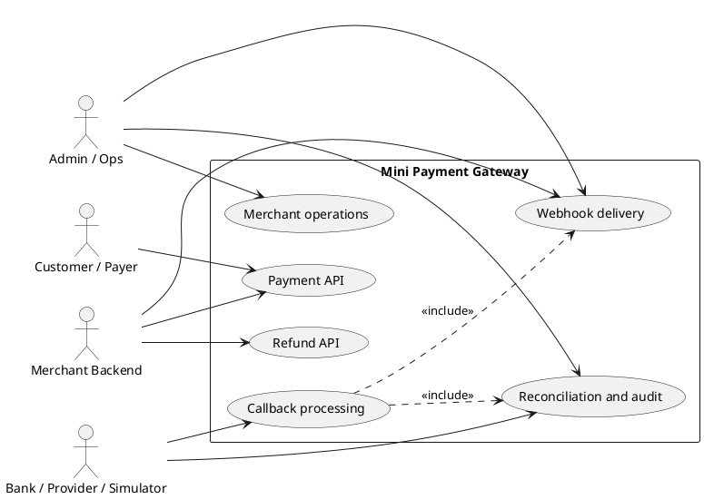
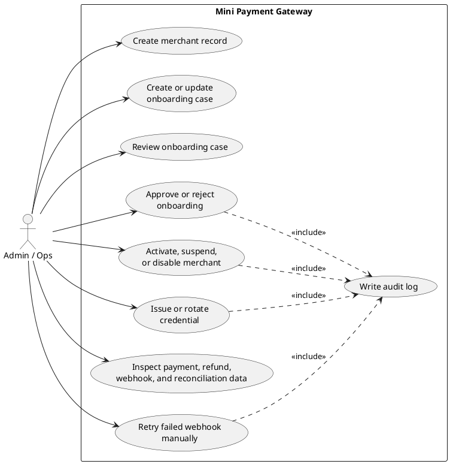
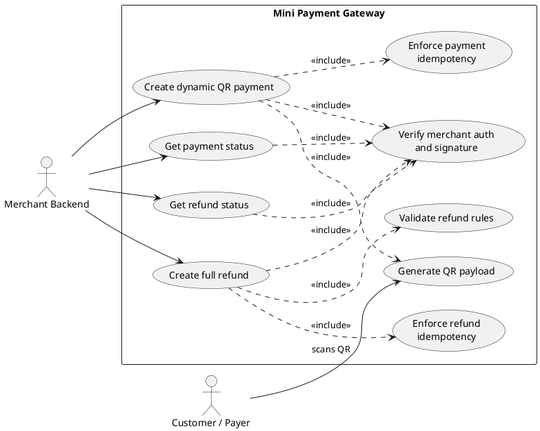
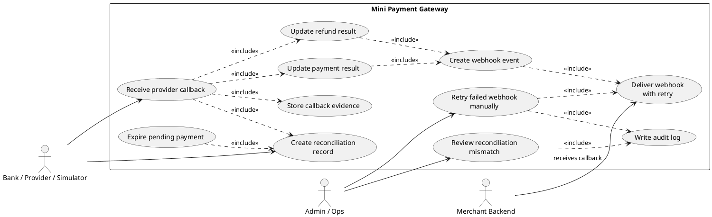

# Use Case Diagrams

These diagrams use PlantUML because Mermaid does not currently provide native
UML use case syntax. The Markdown fences are `plantuml`; render support depends
on the Markdown viewer or IDE plugin.

The same PlantUML source is also available in `usecase_diagram.puml`.

## Actor Overview

## Admin And Onboarding

## Merchant Payment And Refund API

## Callback, Webhook, And Reconciliation

## Core Use Cases

- Admin/Ops operates onboarding, merchant lifecycle, credential rotation, manual webhook retry, reconciliation review, and audit inspection.
- Merchant Backend creates payments, queries payment status, creates refunds, queries refund status, and receives webhook callbacks.
- Customer/Payer scans the dynamic QR and pays through a banking application.
- Bank/Provider/Simulator sends payment or refund results and provides external evidence for reconciliation.

## Out Of Scope

- Merchant self-service onboarding portal.
- Static QR per store.
- Partial refund and multi-refund settlement logic.
- Multi-provider routing.
- Chargeback, dispute, settlement engine, and accounting ledger.
