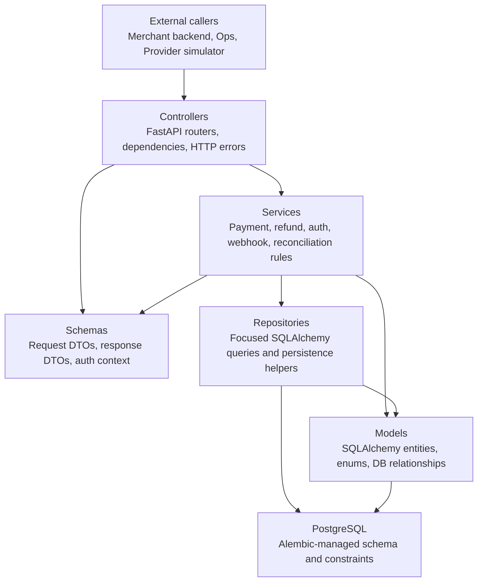
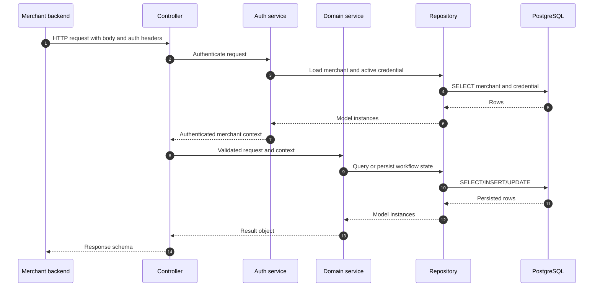
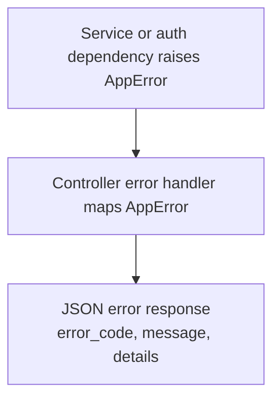

# System Architecture

This backend uses a small MVC-style architecture. It is intentionally simpler
than DDD because the project is a mini payment gateway, but it still keeps HTTP,
business rules, persistence, and infrastructure concerns separate.

## Layer Stack



Dependency direction should move downward. Lower layers must not know about
FastAPI routes or HTTP request objects.

## Package Map

```text
backend/app/
  controllers/   HTTP entry points and request dependencies
  schemas/       API DTOs and small typed context objects
  services/      Business rules and workflow orchestration
  repositories/  Database lookup and persistence helpers
  models/        SQLAlchemy schema, enums, and relationships
  db/            SQLAlchemy engine/session wiring
  core/          Shared config, errors, security, and time helpers
  main.py        FastAPI app assembly
```

## Layer Responsibilities

### Controllers

Controllers are the top application layer. They should:

- define FastAPI routers and endpoint paths;
- read request dependencies such as DB sessions and authenticated merchant;
- pass validated input into services;
- return response schemas;
- avoid direct SQLAlchemy query logic.

Examples after phase 2.5:

- `backend/app/controllers/health_controller.py`
- `backend/app/controllers/deps.py`
- `backend/app/controllers/errors.py`

Future examples:

- `backend/app/controllers/payment_controller.py`
- `backend/app/controllers/refund_controller.py`
- `backend/app/controllers/provider_callback_controller.py`
- `backend/app/controllers/ops_controller.py`
- `backend/app/controllers/webhook_controller.py`

### Schemas

Schemas are the API-facing view layer. They should:

- define request and response contracts;
- keep response shape stable for merchants and ops users;
- hold small typed context objects when needed, such as authenticated merchant context;
- avoid business workflow decisions.

Public response schemas should not expose raw SQLAlchemy objects directly.

### Services

Services are the business layer. They should:

- enforce payment, refund, auth, webhook, and reconciliation rules;
- coordinate repositories and model state transitions;
- raise `AppError` with stable error codes when business rules fail;
- keep transaction semantics clear for the caller.

Examples:

- `backend/app/services/auth_service.py`
- `backend/app/services/merchant_readiness_service.py`
- `backend/app/services/payment_service.py`
- future `refund_service.py` and `webhook_service.py`

### Repositories

Repositories are focused persistence helpers. They should:

- encapsulate common SQLAlchemy queries;
- keep query naming close to business intent;
- avoid deciding high-level payment or refund rules;
- return model instances or simple persisted values.

Examples:

- `backend/app/repositories/merchant_repository.py`
- `backend/app/repositories/credential_repository.py`
- future `payment_repository.py` and `order_reference_repository.py`

### Models

Models are the canonical database schema representation. They should:

- define SQLAlchemy entities, relationships, indexes, and constraints;
- keep lifecycle enum values centralized;
- avoid importing controllers, services, repositories, or schemas.

The model ER diagram lives in `backend/app/models/README.md`.

### Core And DB

`core` and `db` are shared infrastructure layers:

- `core/errors.py` defines application error objects;
- `core/security.py` owns HMAC and hashing helpers;
- `core/time.py` owns timezone-safe time helpers;
- `db/session.py` owns SQLAlchemy session setup.

They should stay generic and reusable. Payment-specific workflows belong in
services, not in `core` or `db`.

## Request Flow



## Error Flow



Controllers should not invent inconsistent error shapes. Business failures should
use `AppError`, and the FastAPI exception handler should keep the public payload
stable.

## Write Rules For New Features

When adding a new feature, place code by responsibility:

- endpoint path and FastAPI dependency wiring -> `controllers/`;
- request/response classes -> `schemas/`;
- business decisions and state transitions -> `services/`;
- SQLAlchemy queries -> `repositories/`;
- database columns, indexes, constraints -> `models/` plus Alembic migration;
- shared generic helper -> `core/`.

If a file needs to import from a layer above it, the boundary is probably wrong.
