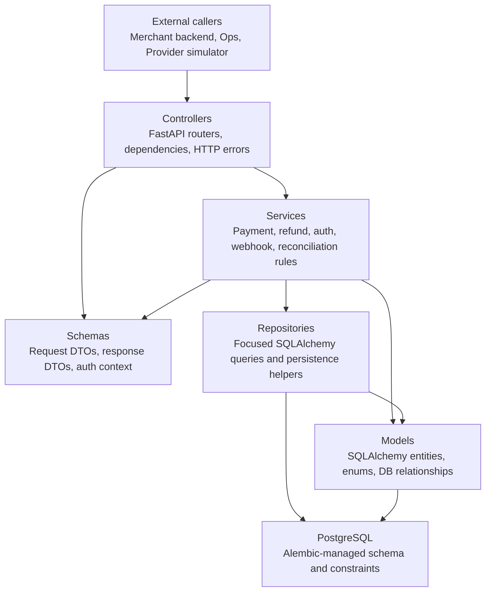
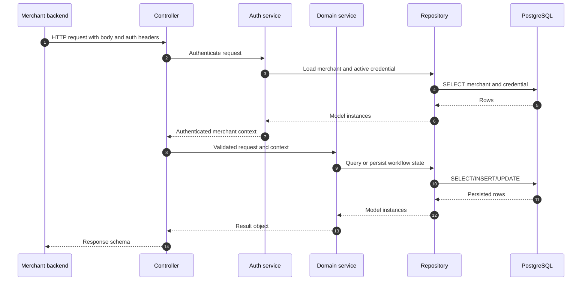
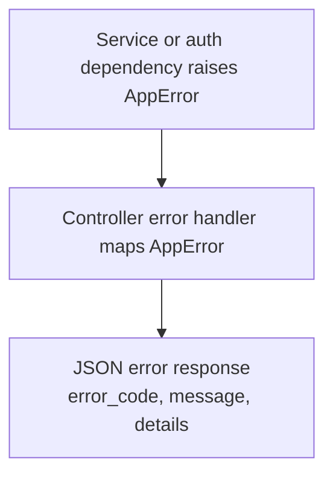

# System Architecture

This backend uses a small MVC-style architecture. It is intentionally simpler
than DDD because the project is a mini payment gateway, but it still keeps HTTP,
business rules, persistence, and infrastructure concerns separate.

## Layer Stack



Dependency direction should move downward. Lower layers must not know about
FastAPI routes or HTTP request objects.

## Package Map

```text
backend/app/
  controllers/   HTTP entry points and request dependencies
  schemas/       API DTOs and small typed context objects
  services/      Business rules and workflow orchestration
  repositories/  Database lookup and persistence helpers
  models/        SQLAlchemy schema, enums, and relationships
  worker/        Background worker loop, config, and advisory locks
  db/            SQLAlchemy engine/session wiring
  core/          Shared config, errors, security, and time helpers
  main.py        FastAPI app assembly
```

## Layer Responsibilities

### Controllers

Controllers are the top application layer. They should:

- define FastAPI routers and endpoint paths;
- read request dependencies such as DB sessions and authenticated merchant;
- pass validated input into services;
- return response schemas;
- avoid direct SQLAlchemy query logic.

Examples:

- `backend/app/controllers/health_controller.py`
- `backend/app/controllers/deps.py`
- `backend/app/controllers/errors.py`
- `backend/app/controllers/payment_controller.py`
- `backend/app/controllers/refund_controller.py`
- `backend/app/controllers/provider_callback_controller.py`
- `backend/app/controllers/webhook_ops_controller.py`
- `backend/app/controllers/ops_merchant_controller.py`
- `backend/app/controllers/ops_reconciliation_controller.py`
- `backend/app/controllers/internal_auth_controller.py`
- `backend/app/controllers/internal_user_controller.py`
- `backend/app/controllers/ops_dashboard_controller.py`
- `backend/app/controllers/ops_merchant_portal_user_controller.py`
- `backend/app/controllers/merchant_portal_auth_controller.py`
- `backend/app/controllers/merchant_portal_controller.py`

### Schemas

Schemas are the API-facing view layer. They should:

- define request and response contracts;
- keep response shape stable for merchants and ops users;
- hold small typed context objects when needed, such as authenticated merchant context;
- avoid business workflow decisions.

Public response schemas should not expose raw SQLAlchemy objects directly.

### Services

Services are the business layer. They should:

- enforce payment, refund, auth, webhook, and reconciliation rules;
- coordinate repositories and model state transitions;
- raise `AppError` with stable error codes when business rules fail;
- keep transaction semantics clear for the caller.

Examples:

- `backend/app/services/auth_service.py`
- `backend/app/services/merchant_readiness_service.py`
- `backend/app/services/payment_service.py`
- `backend/app/services/qr_service.py`
- `backend/app/services/refund_service.py`
- `backend/app/services/audit_service.py`
- `backend/app/services/merchant_ops_service.py`
- `backend/app/services/reconciliation_service.py`
- `backend/app/services/webhook_event_factory.py`
- `backend/app/services/webhook_delivery_service.py`
- `backend/app/services/internal_auth_service.py`
- `backend/app/services/internal_user_admin_service.py`
- `backend/app/services/ops_dashboard_service.py`
- `backend/app/services/merchant_portal_auth_service.py`
- `backend/app/services/merchant_portal_user_admin_service.py`
- `backend/app/services/merchant_portal_service.py`

### Repositories

Repositories are focused persistence helpers. They should:

- encapsulate common SQLAlchemy queries;
- keep query naming close to business intent;
- avoid deciding high-level payment or refund rules;
- return model instances or simple persisted values.

Examples:

- `backend/app/repositories/merchant_repository.py`
- `backend/app/repositories/credential_repository.py`
- `backend/app/repositories/payment_repository.py`
- `backend/app/repositories/merchant_qr_account_repository.py`
- `backend/app/repositories/order_reference_repository.py`
- `backend/app/repositories/webhook_repository.py`
- `backend/app/repositories/audit_repository.py`
- `backend/app/repositories/onboarding_repository.py`
- `backend/app/repositories/reconciliation_repository.py`
- `backend/app/repositories/internal_user_repository.py`
- `backend/app/repositories/ops_dashboard_repository.py`
- `backend/app/repositories/merchant_user_repository.py`

### Ops And Audit Layer

Phase 07 adds internal ops mutation routes and audit trails. Phase 10 layers a
real internal auth/session system plus read/search/stat APIs on top of that.

Phase 10 internal auth works like this:

- `internal_auth_controller` exposes bootstrap, login, logout, `me`, and
  change-password routes;
- `deps.get_current_internal_user(...)` authenticates a signed session cookie;
- `require_ops_user(...)` and `require_admin_user(...)` enforce RBAC at the
  controller boundary;
- `internal_user_admin_service` manages internal operator accounts;
- `ops_dashboard_service` backs the internal Ops dashboard read/search
  experience.

Mutating ops requests still carry an explicit `reason` in the request body for
auditability; controllers now merge that reason with the authenticated internal
user so services receive canonical actor context instead of trusting caller
supplied identity fields.

Audit rows store event code, entity type/id, actor type/id, before/after
state, and reason. State snapshots are sanitized centrally so keys named
`secret_key` or `secret_key_encrypted` are masked recursively.

Ops endpoints remain thin controllers:

- merchant onboarding and lifecycle actions live in `merchant_ops_service`;
- reconciliation list/detail/resolve lives in `reconciliation_service`;
- webhook manual retry accepts optional actor context and remains backward
  compatible with no-body phase 06 retry calls;
- dashboard summary/list/detail routes live in `ops_dashboard_service`;
- internal user admin routes stay separate from money-movement operations.

### Merchant Portal Layer

The Merchant Dashboard uses a separate portal auth boundary instead of merchant
HMAC API credentials:

- `merchant_portal_auth_controller` exposes login, logout, `me`, and
  change-password routes;
- `deps.get_current_merchant_user(...)` authenticates the merchant portal
  session cookie;
- `merchant_portal_user_admin_service` lets internal `ADMIN` users provision,
  update, deactivate, reactivate, and reset passwords for merchant portal users;
- `merchant_portal_service` backs read-only merchant-scoped dashboard summary,
  charts, analytics, explorers, profile, and credential metadata.

Merchant Portal routes must derive merchant scope from the authenticated
`MerchantUser`. They must not accept a client-supplied `merchant_id` for data
scoping.

### Worker Layer

The pilot worker runs inside the backend package as `python -m app.worker.main`.
It uses the same SQLAlchemy session wiring and service layer as the API.

Worker jobs:

- payment expiration via `expiration_service.expire_overdue_payments`;
- due webhook delivery and retry via
  `webhook_delivery_service.deliver_due_webhooks`.

Each job uses a PostgreSQL advisory lock. If another worker already holds the
job lock, the cycle logs a skip and tries again on the next interval. Batch
sizes and intervals are environment-driven.

### Readiness And E2E Layer

Phase 08 adds demo readiness assets without adding new business behavior.
Route-level E2E tests exercise the existing controllers and services together:

- ops onboarding, credential creation, and merchant activation;
- signed merchant payment and refund APIs;
- provider payment/refund callbacks;
- webhook delivery, retry exhaustion, and manual retry audit;
- late callback reconciliation and ops resolution;
- suspended merchant readiness rejection.

The E2E module lives in
`backend/tests/test_e2e_payment_refund_webhook.py`. Operator-facing readiness
docs live in `docs/getting-started/runbook.md`,
`docs/service-operations/merchant-onboarding-sop.md`,
`docs/service-operations/webhook-retry-sop.md`, and
`docs/service-operations/reconciliation-sop.md`. Flow diagrams live under
`docs/architecture/diagrams/`.

### Models

Models are the canonical database schema representation. They should:

- define SQLAlchemy entities, relationships, indexes, and constraints;
- keep lifecycle enum values centralized;
- avoid importing controllers, services, repositories, or schemas.

The model ER diagram lives in `backend/app/models/README.md`.

### Core And DB

`core` and `db` are shared infrastructure layers:

- `core/errors.py` defines application error objects;
- `core/security.py` owns HMAC and hashing helpers;
- `core/time.py` owns timezone-safe time helpers;
- `db/session.py` owns SQLAlchemy session setup.

They should stay generic and reusable. Payment-specific workflows belong in
services, not in `core` or `db`.

## Request Flow



## Error Flow



Controllers should not invent inconsistent error shapes. Business failures should
use `AppError`, and the FastAPI exception handler should keep the public payload
stable.

## Write Rules For New Features

When adding a new feature, place code by responsibility:

- endpoint path and FastAPI dependency wiring -> `controllers/`;
- request/response classes -> `schemas/`;
- business decisions and state transitions -> `services/`;
- SQLAlchemy queries -> `repositories/`;
- database columns, indexes, constraints -> `models/` plus Alembic migration;
- shared generic helper -> `core/`.

If a file needs to import from a layer above it, the boundary is probably wrong.
