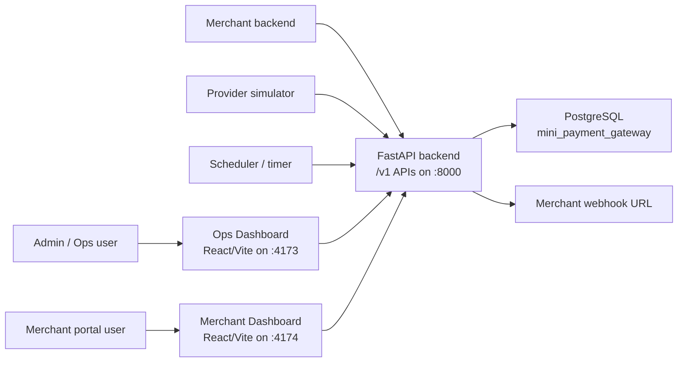
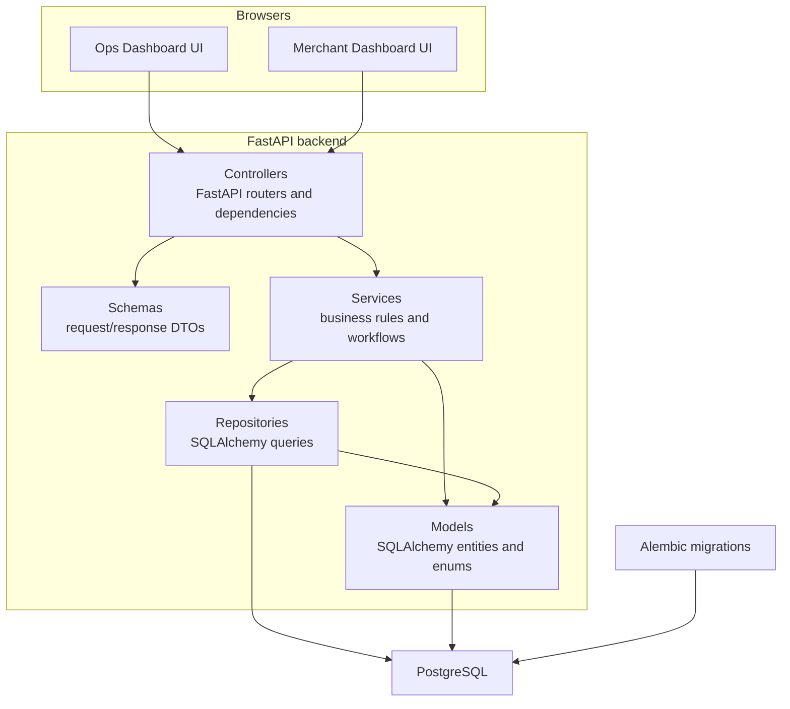
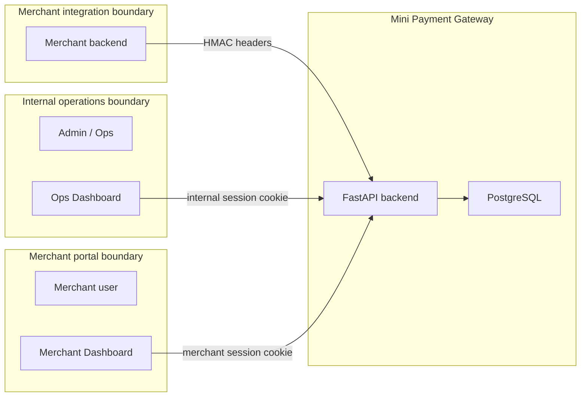
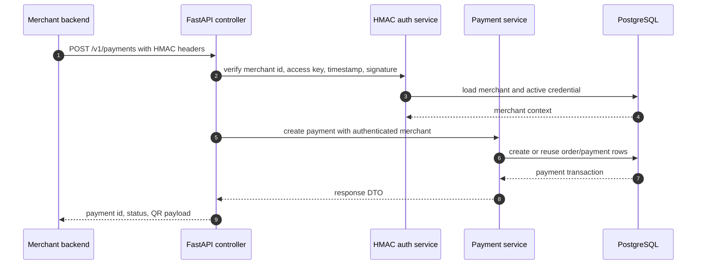
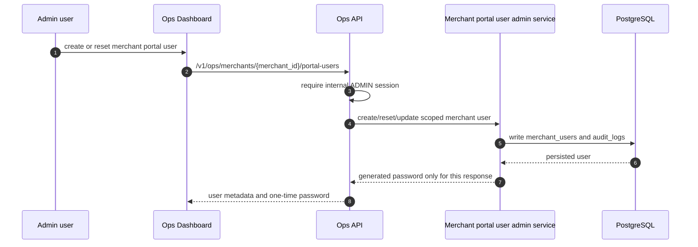
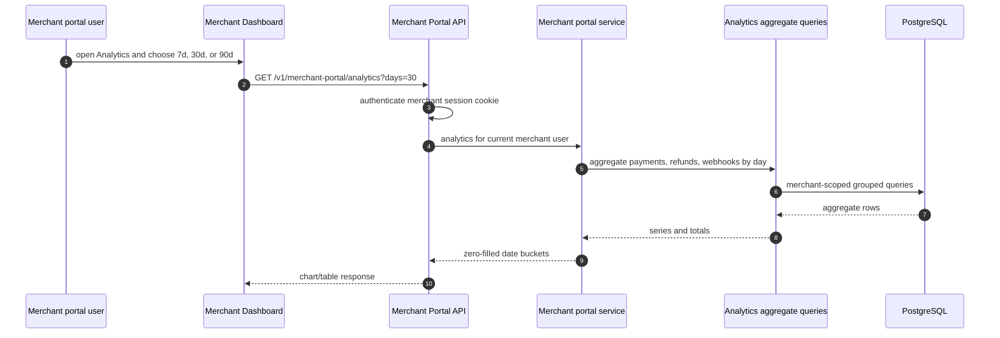

# System Architecture

This document is the presentation-level system architecture for the current
implemented mini payment gateway. It complements `backend.md`, which explains
the internal backend layer structure.

## Implemented System Context

The system has three user-facing API surfaces:

| Surface | Actor | Auth model | Main purpose |
| --- | --- | --- | --- |
| Merchant API | Merchant backend | HMAC headers | Create/query payments and refunds. |
| Ops API | Admin/Ops user | Internal HttpOnly session cookie | Operate merchants, users, reconciliation, webhooks, and audit workflows. |
| Merchant Portal API | Merchant portal user | Merchant HttpOnly session cookie | Read merchant-scoped dashboard data and change own password. |

Provider callbacks and scheduler-triggered jobs are separate system inputs. They
do not use the merchant dashboard session or merchant HMAC credentials.

## Runtime Containers

The frontend apps are separate containers in sandbox deployment:

- `ops-dashboard` serves the internal UI on port `4173`.
- `merchant-dashboard` serves the merchant portal UI on port `4174`.
- Both proxy `/api` to the FastAPI backend in local and container deployment.

## Trust Boundaries

Important boundaries:

- Merchant HMAC credentials are for server-to-server API calls only.
- Merchant Dashboard users are stored in `merchant_users` and login with a
  separate session cookie.
- Ops users are stored in `internal_users`; only `ADMIN` users can provision
  merchant portal users.
- Merchant Portal APIs never accept `merchant_id` from the client for scoping.
  The backend resolves merchant scope from the authenticated portal user.
- Raw credential secrets and plaintext generated passwords are never
  retrievable after the immediate create/reset response.

## Component Responsibilities

| Component | Responsibility |
| --- | --- |
| Ops Dashboard | Internal workflow UI for merchant lifecycle, credentials, reconciliation, audit, internal users, and merchant portal user provisioning. |
| Merchant Dashboard | Read-only merchant portal for overview, analytics, payments, refunds, webhooks, profile, credentials, and password change. |
| Controllers | Define routes, dependencies, auth boundaries, and response models. |
| Services | Enforce payment, refund, webhook, auth, merchant lifecycle, audit, and analytics rules. |
| Repositories | Own focused SQLAlchemy aggregate and lookup queries. |
| Models | Define tables, enums, relationships, constraints, and indexes. |
| Alembic | Applies database schema changes before backend restart in sandbox deploy. |

## Key Request Flows

### Merchant Creates A Payment

### Admin Provisions A Merchant Portal User

### Merchant Reads Analytics

## Out Of Scope For The Current Implementation

The current branch does not implement settlement, disputes, accounting ledger,
multi-provider routing, multi-currency support, merchant self-service
onboarding, CSV export, or realtime analytics polling.
