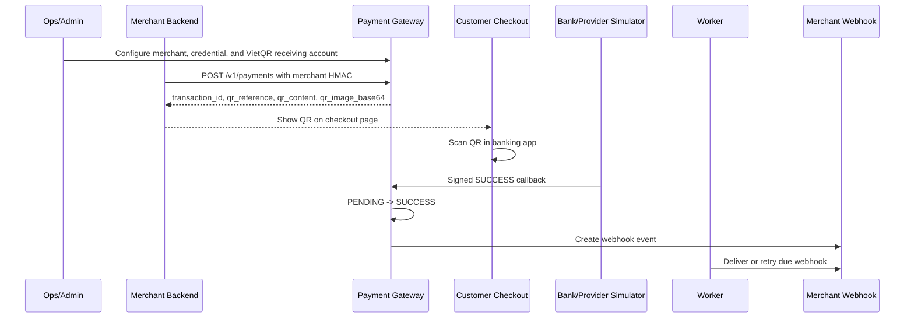

# VietQR Pilot Demo Guide

This guide is the recommended walkthrough for explaining the pilot-ready
gateway to an instructor or reviewer. The current scope is API-only: merchant
systems create payments through the Merchant API, the gateway returns a VietQR
payload and PNG QR image, and the provider/bank result is demonstrated with a
signed simulator callback.

For the separate visual merchant checkout and the webhook-driven final result,
use `e2e-payment-demo.md`.

## What The Demo Proves



In a real integration, the merchant backend would display `qr_image_base64` on
its checkout page and the bank/provider would send the callback. In this pilot,
the Postman collection or smoke scripts play the merchant backend and provider
simulator roles so the demo is repeatable without moving real money.

## Local Demo Setup

From the repository root:

```powershell
docker compose up -d postgres
cd backend
..\.venv\Scripts\python.exe -m pip install -e .
..\.venv\Scripts\python.exe -m alembic upgrade head
..\.venv\Scripts\python.exe scripts\seed_dashboard_demo.py
```

Start the backend:

```powershell
cd backend
..\.venv\Scripts\python.exe -m uvicorn app.main:app --host 127.0.0.1 --port 8000
```

Start the worker in another terminal:

```powershell
cd backend
..\.venv\Scripts\python.exe -m app.worker.main
```

Start dashboards from the repository root:

```powershell
npm run ops-dashboard:dev
npm run merchant-dashboard:dev
```

Demo merchant portal login after seeding:

- Merchant ID: `m_demo_dashboard`
- Email: `merchant.demo@example.com`
- Password: `MerchantDemo123!`

Open `http://127.0.0.1:4174/payments`, choose `pay_demo_003`, and show:

- `qr_reference` such as `PDEMO003`
- VietQR `qr_content` starting with `000201...`
- QR image rendered from `qr_image_base64`

## Postman/Newman Demo

The happy-path collection now logs in an internal Admin/Ops user before it calls
Ops setup APIs. Use an existing internal user created through the Ops
bootstrap/login flow.

Run the full instructor-friendly path:

```powershell
npx --yes newman run postman/scenarios/happy-path.collection.json `
  -e postman/mini-payment-gateway.sandbox.environment.json `
  --folder "E2E-01 Merchant Onboarding To Successful Payment And Refund" `
  --env-var baseUrl=http://127.0.0.1:8000 `
  --env-var internal_email="<admin-email>" `
  --env-var internal_password="<admin-password>" `
  --env-var provider_id=simulator `
  --env-var provider_callback_secret=dev-insecure-provider-callback-secret-change-me
```

What to point out while it runs:

1. `Internal Login` obtains the Ops session cookie.
2. `Create QR Account` configures the merchant receiving account.
3. `Create Payment` is the merchant-backend action. It returns
   `qr_reference`, `qr_content`, and `qr_image_base64`.
4. `Payment Callback Success` is the signed bank/provider simulator result.
5. `Create Refund` and `Refund Callback Success` prove the full-refund path.

If using the Postman desktop app, import:

- `postman/mini-payment-gateway.sandbox.environment.json`
- `postman/scenarios/happy-path.collection.json`

Then set `internal_email`, `internal_password`, and run the folder
`E2E-01 Merchant Onboarding To Successful Payment And Refund`.

## Smoke Script Demo

These scripts are better for fast CLI evidence because they start temporary API
servers, seed their own data, and print compact JSON summaries.

```powershell
cd backend
..\.venv\Scripts\python.exe scripts\smoke_payment_api.py
..\.venv\Scripts\python.exe scripts\smoke_provider_callback_api.py
..\.venv\Scripts\python.exe scripts\smoke_refund_api.py
..\.venv\Scripts\python.exe scripts\smoke_webhook_api.py
..\.venv\Scripts\python.exe scripts\smoke_ops_reconciliation_api.py
```

Use `smoke_payment_api.py` to show QR creation evidence:

- `db_qr_is_vietqr: true`
- `db_qr_image_is_data_url: true`
- `db_qr_reference: ...`

Use `smoke_webhook_api.py` to show the post-payment webhook handoff:

- `event_status_before_delivery: PENDING`
- `event_status_after_delivery: DELIVERED`
- `signature_valid: true`

## Sandbox Deployment Notes

When this branch is deployed on a sandbox server, make sure the new dependency,
migration, provider callback secret, and worker are present:

```bash
git fetch origin
git checkout feature/e2e-payment-demo
git pull --ff-only origin feature/e2e-payment-demo

cd backend
python -m pip install -e .
python -m alembic upgrade head
python scripts/seed_dashboard_demo.py
```

Required sandbox environment additions:

```bash
PROVIDER_CALLBACK_SECRETS=simulator=<change-me-provider-secret>
WORKER_ENABLED=true
WORKER_LOOP_INTERVAL_SECONDS=15
PAYMENT_EXPIRATION_BATCH_LIMIT=200
WEBHOOK_DELIVERY_BATCH_LIMIT=100
```

If the sandbox uses Docker Compose, rebuild services after pulling:

```bash
docker compose -f docker-compose.sandbox.yml config --quiet
docker compose -f docker-compose.sandbox.yml up -d --build backend worker ops-dashboard merchant-dashboard
docker compose -f docker-compose.sandbox.yml logs -f backend worker
```

Health checks:

```bash
curl http://127.0.0.1:8000/health
curl http://127.0.0.1:8000/docs
```

## Speaking Notes

Suggested explanation:

> This project is a payment gateway API pilot. The merchant backend creates a
> signed payment, the gateway generates a VietQR payload and QR image, the
> customer would scan that QR in a banking app, and the provider result is
> represented by a signed simulator callback. After the callback, the gateway
> updates payment state and the worker delivers webhook events back to the
> merchant.

Important limitation to state clearly:

- The demo QR should not be used for real money unless the receiving account is
  configured with a real bank account owned by the demo operator.
- This branch does not add hosted checkout or merchant self-service payment
  creation in the Merchant Dashboard. The merchant dashboard is read-only and
  shows payments created by API/smoke/Postman.
