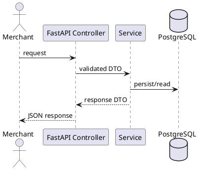

# Readiness Docs And E2E Implementation Plan

> **For agentic workers:** REQUIRED SUB-SKILL: Use superpowers:subagent-driven-development (recommended) or superpowers:executing-plans to implement this plan task-by-task. Steps use checkbox (`- [ ]`) syntax for tracking.

**Goal:** Finish MVP demo readiness with end-to-end coverage, operator runbooks,
sequence diagrams, and a concise root README.

**Architecture:** Phase 08 adds no new money-movement business behavior. It
validates the existing phase 02-07 slices together through FastAPI entry points,
documents how operators/developers run the MVP, and keeps persistence concerns
inside existing repositories/services.

**Tech Stack:** FastAPI `TestClient`, standard `unittest`, SQLAlchemy/PostgreSQL
smoke scripts, Markdown docs, PlantUML sequence diagrams, existing HMAC helpers,
and existing phase 07 ops APIs.

---

## Implementation Status

Completed in phase 08. The app now has:

- ops merchant onboarding, credential, activation, suspension, and disable APIs;
- reconciliation list/detail/resolve APIs;
- audit logging for ops actions and optional webhook manual retry context;
- smoke scripts for payment, provider callback, refund, webhook delivery, and
  ops reconciliation.
- route-level E2E tests for onboarding, payment, refund, webhook delivery,
  reconciliation resolution, manual webhook retry, and suspended merchant
  readiness;
- sequence diagrams, runbook, SOPs, root README, and completion record.

Use the current repository checkout directly. Do not create a branch or
worktree unless the user asks for one. Commit only when requested.

## Scope

Implement:

- E2E scenario matrix updates for phase 08.
- Automated E2E coverage for:
  - onboarding -> payment success -> webhook -> refund success -> webhook;
  - duplicate/idempotency payment behavior;
  - late callback reconciliation and ops resolution;
  - webhook retry and manual retry audit;
  - suspended merchant payment/refund rejection.
- Sequence diagrams for payment, refund, webhook retry, and reconciliation.
- Developer/operator runbook.
- Merchant onboarding SOP.
- Webhook retry SOP.
- Reconciliation SOP.
- Root `README.md`.
- Phase 08 completion record.

Do not implement:

- full internal auth/JWT/RBAC;
- settlement, disputes, analytics, multi-provider routing, partial refunds;
- new database columns or Alembic migrations unless a real schema gap is found;
- UI;
- a second scenario catalog.

## Design Decisions

- E2E tests should exercise FastAPI routes where practical, not only service
  functions.
- Keep unit-style tests independent from external services. If an E2E test needs
  database persistence, use the existing configured PostgreSQL path deliberately
  and clean up deterministic test data.
- Prefer one E2E test module with focused helper functions over scattering
  orchestration helpers through production code.
- Use the existing ops APIs for merchant setup instead of direct merchant DB
  seed when testing route-level happy paths.
- Use deterministic suffixes/UUIDs in tests to avoid cross-test collisions.
- Use existing `sign_hmac_sha256`, `sha256_hex`, and auth header conventions
  rather than reimplementing signing loosely.
- Webhook delivery tests can use the existing fake HTTP client pattern from
  `backend/tests/test_webhook_delivery_service.py`.
- Sequence diagrams live under `docs/architecture/diagrams/` with the other
  architecture references.
- Root `README.md` should be a short operator/developer entry point that links
  to detailed docs instead of duplicating them.

## Scenario References

Use `docs/testing/scenarios/happy-path.md` as the E2E source for:

- `E2E-01 Merchant Onboarding To Successful Payment And Refund`
- `E2E-02 Duplicate And Idempotency Path`
- `E2E-03 Late Callback Reconciliation Path`
- `E2E-04 Webhook Retry And Manual Retry Path`

Use grouped scenario files for detailed assertions:

- `docs/testing/scenarios/auth.md`
- `docs/testing/scenarios/merchant.md`
- `docs/testing/scenarios/payment.md`
- `docs/testing/scenarios/callback.md`
- `docs/testing/scenarios/refund.md`
- `docs/testing/scenarios/webhook.md`
- `docs/testing/scenarios/ops.md`
- `docs/testing/scenarios/reconciliation.md`
- `docs/testing/matrix.md`

## Current Code Map

Existing source that phase 08 should build on:

- `backend/app/main.py`
  - central FastAPI app and router registration.
- `backend/app/controllers/deps.py`
  - `get_db`;
  - `get_authenticated_merchant`.
- `backend/app/controllers/ops_merchant_controller.py`
  - internal merchant setup and state routes.
- `backend/app/controllers/payment_controller.py`
  - merchant payment routes.
- `backend/app/controllers/refund_controller.py`
  - merchant refund routes.
- `backend/app/controllers/provider_callback_controller.py`
  - provider callback routes.
- `backend/app/controllers/webhook_ops_controller.py`
  - manual webhook retry route.
- `backend/app/controllers/ops_reconciliation_controller.py`
  - reconciliation review routes.
- `backend/app/services/expiration_service.py`
  - expires overdue pending payments for late callback scenarios.
- `backend/app/services/webhook_delivery_service.py`
  - delivers webhook events and handles manual retry.
- `backend/scripts/smoke_ops_reconciliation_api.py`
  - runnable API + DB smoke that can inspire E2E setup.
- `backend/tests/test_webhook_delivery_service.py`
  - fake HTTP client pattern for delivery tests.

## Files

- Create: `backend/tests/test_e2e_payment_refund_webhook.py`
- Create: `docs/architecture/diagrams/payment-flow.puml`
- Create: `docs/architecture/diagrams/refund-flow.puml`
- Create: `docs/architecture/diagrams/webhook-retry-flow.puml`
- Create: `docs/architecture/diagrams/reconciliation-flow.puml`
- Create: `docs/getting-started/runbook.md`
- Create: `docs/operations/merchant-onboarding-sop.md`
- Create: `docs/operations/webhook-retry-sop.md`
- Create: `docs/operations/reconciliation-sop.md`
- Create: `README.md`
- Create: `docs/history/completions/phase-08.md`
- Modify: `docs/testing/scenarios/happy-path.md`
- Modify: `docs/testing/e2e.md`
- Modify: `docs/testing/matrix.md`
- Modify: `docs/history/README.md`

## Tasks

### Task 0: Baseline And Phase 07 Handoff Check

- [ ] Run:

```powershell
cd backend
& 'D:\Anaconda\envs\mini-payment-gateway\python.exe' -m unittest discover tests -v
```

- [ ] Expected: current phase 0-7 tests pass.
- [ ] Run:

```powershell
cd backend
& 'D:\Anaconda\envs\mini-payment-gateway\python.exe' -m alembic upgrade head
& 'D:\Anaconda\envs\mini-payment-gateway\python.exe' scripts\smoke_ops_reconciliation_api.py
```

- [ ] Expected: smoke JSON shows merchant activation `ACTIVE`,
  reconciliation `RESOLVED`, and phase 07 audit events present.
- [ ] If baseline fails, stop and fix or document the pre-existing failure
  before writing phase 08 tests.

### Task 1: Update E2E Scenario Matrix

- [ ] Modify `docs/testing/matrix.md`.
- [ ] Add explicit phase 08 rows or update existing rows for:
  - `E2E-01` onboarding to successful payment/refund/webhook;
  - `E2E-02` duplicate/idempotency path;
  - `E2E-03` late callback reconciliation path;
  - `E2E-04` webhook retry/manual retry path.
- [ ] Keep target test path as `backend/tests/test_e2e_payment_refund_webhook.py`.
- [ ] Mark current status as `Covered` only after Task 3-6 tests exist.
- [ ] Modify `docs/testing/scenarios/happy-path.md` to remove the old direct DB seed
  workaround under onboarding and point to phase 07 ops APIs.
- [ ] Modify `docs/testing/e2e.md` after tests land so the current
  snapshot lists the E2E coverage accurately.

### Task 2: Add E2E Test Scaffolding

- [ ] Create `backend/tests/test_e2e_payment_refund_webhook.py`.
- [ ] Include helpers for:
  - deterministic unique suffixes;
  - ops actor JSON;
  - merchant onboarding via ops routes;
  - merchant HMAC headers;
  - provider callback bodies;
  - webhook fake HTTP client;
  - DB cleanup if using real DB-backed E2E;
  - app dependency override cleanup.
- [ ] If using `TestClient` against the real app, use the existing route paths:
  - `POST /v1/ops/merchants`;
  - `PUT /v1/ops/merchants/{merchant_id}/onboarding-case`;
  - `POST /v1/ops/merchants/{merchant_id}/onboarding-case/approve`;
  - `POST /v1/ops/merchants/{merchant_id}/credentials`;
  - `POST /v1/ops/merchants/{merchant_id}/activate`;
  - `POST /v1/payments`;
  - `POST /v1/provider/callbacks/payment`;
  - `POST /v1/refunds`;
  - `POST /v1/provider/callbacks/refund`;
  - `GET /v1/ops/reconciliation`;
  - `POST /v1/ops/reconciliation/{record_id}/resolve`;
  - `POST /v1/ops/webhooks/{event_id}/retry`.
- [ ] Write the first failing test that imports the helper module/class and
  asserts the setup helper can create and activate a merchant through ops routes.
- [ ] Run:

```powershell
cd backend
& 'D:\Anaconda\envs\mini-payment-gateway\python.exe' -m unittest tests.test_e2e_payment_refund_webhook -v
```

- [ ] Expected before implementation: FAIL for missing helper/test behavior.
- [ ] Implement the minimal helper code and rerun.
- [ ] Expected after implementation: PASS.

### Task 3: Add E2E-01 Happy Path Test

- [ ] In `backend/tests/test_e2e_payment_refund_webhook.py`, write
  `test_onboarding_to_successful_payment_refund_and_webhooks`.
- [ ] Test flow:
  - create merchant via ops;
  - submit and approve onboarding;
  - create active credential;
  - activate merchant;
  - create payment with signed merchant request;
  - send provider success callback;
  - verify `payment.succeeded` webhook event exists;
  - deliver payment webhook with fake HTTP 2xx client;
  - create full refund with signed merchant request;
  - send refund success callback;
  - verify `refund.succeeded` webhook event exists;
  - deliver refund webhook with fake HTTP 2xx client;
  - verify audit rows include merchant, onboarding, credential, and activation
    events.
- [ ] Run the test and verify it fails for the missing E2E orchestration.
- [ ] Implement only the code/helpers needed to pass this test.
- [ ] Rerun:

```powershell
cd backend
& 'D:\Anaconda\envs\mini-payment-gateway\python.exe' -m unittest tests.test_e2e_payment_refund_webhook -v
```

- [ ] Expected: PASS.

### Task 4: Add E2E-02 Duplicate And Idempotency Test

- [ ] Write `test_duplicate_and_idempotency_payment_path`.
- [ ] Test flow:
  - setup active merchant through helper;
  - create payment with `X-Idempotency-Key`;
  - repeat semantically identical create and expect same `transaction_id`;
  - repeat same order with different amount and expect
    `PAYMENT_PENDING_EXISTS`;
  - mark payment success through callback;
  - create same order again and expect `PAYMENT_ALREADY_SUCCESS`.
- [ ] Include at least one auth/signature failure assertion for a bad signature
  returning `AUTH_INVALID_SIGNATURE`.
- [ ] Run the focused E2E test and verify RED, then implement minimal helper
  changes and verify GREEN.

### Task 5: Add E2E-03 Late Callback Reconciliation Test

- [ ] Write `test_late_callback_reconciliation_can_be_resolved_by_ops`.
- [ ] Test flow:
  - setup active merchant through helper;
  - create payment with short expiration;
  - run `expiration_service.expire_overdue_payments(...)` with a later `now`;
  - send provider success callback after expiration;
  - verify payment remains `EXPIRED`;
  - verify reconciliation record has `PENDING_REVIEW` and
    `LATE_SUCCESS_AFTER_EXPIRATION`;
  - resolve via `POST /v1/ops/reconciliation/{record_id}/resolve`;
  - verify response and DB state are `RESOLVED`;
  - verify `RECONCILIATION_RESOLVED` audit row exists.
- [ ] Run focused E2E test RED/GREEN.

### Task 6: Add E2E-04 Webhook Retry And Manual Retry Test

- [ ] Write `test_webhook_retry_and_manual_retry_are_auditable`.
- [ ] Test flow:
  - setup active merchant through helper;
  - create and finalize a payment to create webhook event;
  - deliver webhook with fake HTTP 500 client;
  - verify event becomes retryable with `next_retry_at`;
  - force or simulate failed status after retry exhaustion if needed;
  - call `POST /v1/ops/webhooks/{event_id}/retry` with actor context;
  - fake final HTTP 2xx delivery;
  - verify delivery attempt count increased;
  - verify `WEBHOOK_MANUAL_RETRY` audit row exists.
- [ ] Add suspended merchant assertion:
  - suspend merchant through ops route;
  - signed `POST /v1/payments` returns `MERCHANT_NOT_ACTIVE`;
  - signed `POST /v1/refunds` also rejects for merchant readiness when a
    refundable payment exists or via service-level helper if route setup would
    obscure the readiness assertion.
- [ ] Run focused E2E test RED/GREEN.

### Task 7: Add Sequence Diagrams

- [ ] Create `docs/architecture/diagrams/payment-flow.puml`.
- [ ] Create `docs/architecture/diagrams/refund-flow.puml`.
- [ ] Create `docs/architecture/diagrams/webhook-retry-flow.puml`.
- [ ] Create `docs/architecture/diagrams/reconciliation-flow.puml`.
- [ ] Use PlantUML:



- [ ] Keep route names and event/status names aligned with implemented code.

### Task 8: Add Runbook

- [ ] Create `docs/getting-started/runbook.md`.
- [ ] Include:
  - environment prerequisites;
  - dependency install command;
  - `docker compose up -d postgres`;
  - Alembic migration command;
  - API start command;
  - unit test command;
  - smoke commands;
  - how to create demo merchant through ops APIs;
  - how to create a payment and provider callback;
  - how to inspect webhook attempts and reconciliation records.
- [ ] Use existing scripts as canonical commands:

```powershell
cd backend
& 'D:\Anaconda\envs\mini-payment-gateway\python.exe' scripts\smoke_payment_api.py
& 'D:\Anaconda\envs\mini-payment-gateway\python.exe' scripts\smoke_provider_callback_api.py
& 'D:\Anaconda\envs\mini-payment-gateway\python.exe' scripts\smoke_refund_api.py
& 'D:\Anaconda\envs\mini-payment-gateway\python.exe' scripts\smoke_webhook_api.py
& 'D:\Anaconda\envs\mini-payment-gateway\python.exe' scripts\smoke_ops_reconciliation_api.py
```

### Task 9: Add SOPs

- [ ] Create `docs/operations/merchant-onboarding-sop.md`.
- [ ] Include operator steps for register, submit case, approve/reject, create
  credential, activate, suspend, disable, and rotate credential.
- [ ] Create `docs/operations/webhook-retry-sop.md`.
- [ ] Include how to identify failed webhook events, retry manually, and include
  optional audit context.
- [ ] Create `docs/operations/reconciliation-sop.md`.
- [ ] Include how to list, inspect, resolve, and audit reconciliation records.
- [ ] Keep SOPs short, operator-focused, and link to `docs/api/ops.md` for
  request/response details.

### Task 10: Add Root README

- [ ] Create `README.md`.
- [ ] Include:
  - project purpose;
  - backend location;
  - quick start;
  - test command;
  - smoke command list;
  - links to `docs/getting-started/runbook.md`, `docs/api/README.md`,
    `docs/testing/e2e.md`, and `docs/architecture/backend.md`.
- [ ] Keep it concise; detailed operating steps belong in `docs/getting-started/runbook.md`.

### Task 11: Update Plan And Completion Docs

- [ ] Modify `docs/history/README.md`:
  - mark phase 08 completed after tests/docs pass;
  - add phase 08 E2E test command;
  - add links to runbook/SOPs.
- [ ] Create `docs/history/completions/phase-08.md` with:
  - completed scope;
  - tests run;
  - smoke/manual verification;
  - remaining post-MVP notes.
- [ ] Update `docs/history/phases/phase-08-readiness-docs-and-e2e.md` implementation
  status from ready to completed only after implementation and verification.

### Task 12: Full Verification

- [ ] Run:

```powershell
cd backend
& 'D:\Anaconda\envs\mini-payment-gateway\python.exe' -m unittest tests.test_e2e_payment_refund_webhook -v
& 'D:\Anaconda\envs\mini-payment-gateway\python.exe' -m unittest discover tests -v
```

- [ ] Run DB smoke scripts:

```powershell
cd backend
& 'D:\Anaconda\envs\mini-payment-gateway\python.exe' -m alembic upgrade head
& 'D:\Anaconda\envs\mini-payment-gateway\python.exe' scripts\smoke_payment_api.py
& 'D:\Anaconda\envs\mini-payment-gateway\python.exe' scripts\smoke_provider_callback_api.py
& 'D:\Anaconda\envs\mini-payment-gateway\python.exe' scripts\smoke_refund_api.py
& 'D:\Anaconda\envs\mini-payment-gateway\python.exe' scripts\smoke_webhook_api.py
& 'D:\Anaconda\envs\mini-payment-gateway\python.exe' scripts\smoke_ops_reconciliation_api.py
```

- [ ] Start server:

```powershell
cd backend
& 'D:\Anaconda\envs\mini-payment-gateway\python.exe' -m uvicorn app.main:app --host 127.0.0.1 --port 8000
```

- [ ] Manually verify:
  - `GET http://127.0.0.1:8000/health`;
  - `GET http://127.0.0.1:8000/docs`.
- [ ] Run from repo root:

```powershell
git diff --check
```

- [ ] Expected: no whitespace errors.

### Task 13: Commit

- [ ] Only if the user asks for a commit, stage phase 08 files and commit.
- [ ] Commit message suggestion:

```text
docs: add demo readiness docs and e2e coverage
```

## Acceptance Criteria

- MVP can be demonstrated end-to-end from ops onboarding through payment,
  refund, webhook delivery, and reconciliation review.
- `backend/tests/test_e2e_payment_refund_webhook.py` covers `E2E-01` through
  `E2E-04`.
- Docs explain how to operate core flows without reading source code.
- Sequence diagrams exist for payment, refund, webhook retry, and
  reconciliation.
- Root README points developers/operators to the right commands and docs.
- Scenario matrix accurately reflects phase 08 E2E coverage.
- No out-of-scope features are added.
