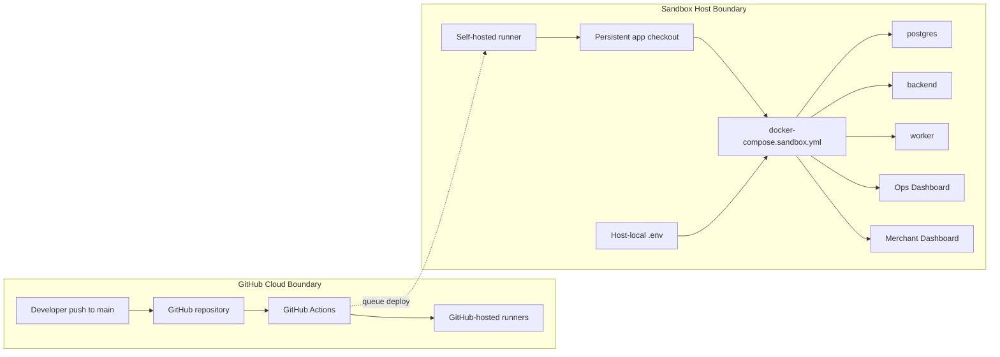
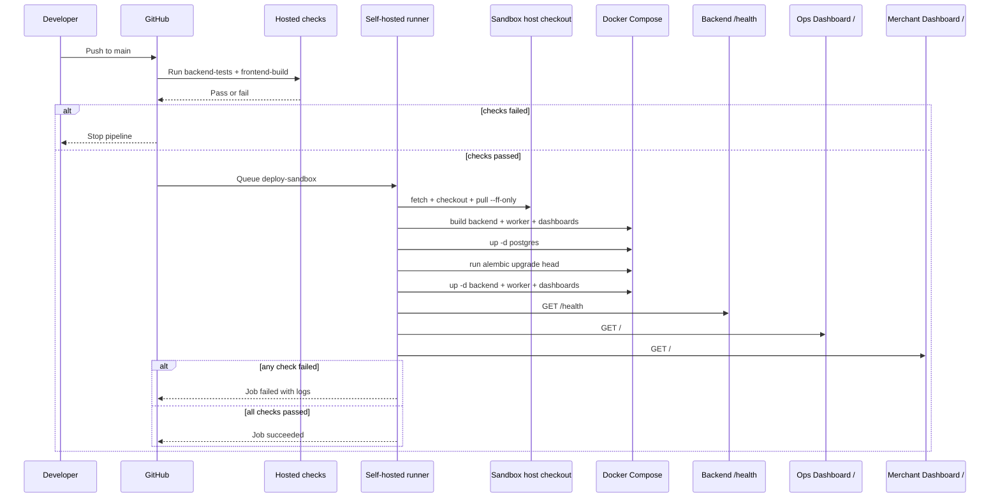

# DevOps Architecture

This document explains the current sandbox DevOps design.

Use it when you need to understand:

- why the sandbox uses this deployment topology;
- how code moves from `main` to the running host;
- which systems participate in verification and deploy;
- where trust boundaries and secrets live;
- which invariants the runtime depends on.

This file owns system shape and deployment design.
It does **not** own day-0 provisioning, day-2 runbooks, or current live host
facts.

Related docs:

- `sandbox-setup-from-zero.md` - day-0 host provisioning
- `sandbox-deployment.md` - day-2 operations
- `sandbox-access-inventory.md` - current host facts and inspect commands

## Architecture Summary

The sandbox uses a split CI/CD model:

- GitHub-hosted runners execute verification jobs.
- A self-hosted runner on the sandbox host executes the deploy job locally.
- The host keeps a persistent Git checkout and deploys with Docker Compose.
- The runtime stack is PostgreSQL, FastAPI backend, worker, Ops Dashboard, and
  Merchant Dashboard.
- Deployment is accepted only if backend health, worker health, and both
  dashboard roots pass.

The key decision is **internal pull deploy**:

- GitHub does not SSH into the sandbox host.
- The sandbox host connects outbound to GitHub over HTTPS.
- Runtime secrets stay on the host, outside Git history and workflow logs.

## Topology

## Runtime Shape

The sandbox runtime is a host-local Git checkout plus a Docker Compose stack.

Core components:

- `postgres`
  - sandbox database runtime
- `backend`
  - FastAPI application runtime
- `worker`
  - `python -m app.worker.main`; expires overdue payments and delivers due
    webhook retries with PostgreSQL advisory locks
- `ops-dashboard`
  - internal operator UI served by nginx and proxying `/api` to the backend
- `merchant-dashboard`
  - merchant-facing read-only UI served by nginx and proxying `/api` to the
    backend

State and configuration:

- Docker Compose defines the runtime stack.
- A server-local `.env` file supplies runtime configuration and secrets.
- The host checkout is the deploy target used by both automated and manual
  deploy paths.

Current live host, runner, ports, and secret names are tracked in
`sandbox-access-inventory.md`.

## Trust Boundaries

### Control Plane

- GitHub is the external control plane for source and workflow orchestration.
- The sandbox host is the internal execution plane for deploy and runtime.

### Network Direction

- GitHub-hosted runners talk only to GitHub-managed infrastructure.
- The self-hosted runner connects outbound to GitHub over HTTPS.
- Internal clients can connect to the published PostgreSQL, backend, Ops
  Dashboard, and Merchant Dashboard ports.

### Secret Placement

- Runtime secrets live in the sandbox host `.env`.
- The deploy workflow does not need SSH secrets because the runner is installed
  directly on the target host.
- GitHub Actions only needs repository access plus the registered self-hosted
  runner.

### Security Implications

- The runner is non-root, but Docker group access is privileged.
- Anyone who can execute arbitrary jobs on the self-hosted runner effectively
  has strong control over the sandbox host.
- This is acceptable for the current internal sandbox, but it should be treated
  as a high-trust environment.

## Deployment Flow

## Deployment Gates

The pipeline has three gates:

1. **Verification gate**
   `backend-tests` and `frontend-build` must pass before deploy is eligible.
2. **Fast-forward gate**
   the sandbox checkout must be able to `pull --ff-only` without drift.
3. **Runtime gate**
   backend health plus both dashboard roots must pass after restart.

If any gate fails, the deploy is rejected and the host should be inspected
through the day-2 runbook.

## Why This Topology Was Chosen

The current design intentionally favors:

- a small number of moving parts;
- shared behavior between manual and automated deploys;
- easy on-host inspection and recovery;
- no inbound GitHub-to-server SSH dependency.

The main tradeoff is that the target host is also the deploy-runner host and
builds images locally instead of consuming immutable promoted images.

## Hardening Roadmap

This sandbox design is correct for internal use, but it is not the final
production-grade shape.

Recommended next steps:

1. Move runtime secrets to stronger secret management.
2. Add explicit environment approval if deploys to `main` need a manual gate.
3. Introduce reverse proxy and TLS if the dashboards need broader access.
4. Add monitoring, alerting, and log aggregation.
5. Add PostgreSQL backup and restore procedures.
6. Consider registry-based image promotion if environment count or deploy
   frequency grows.
