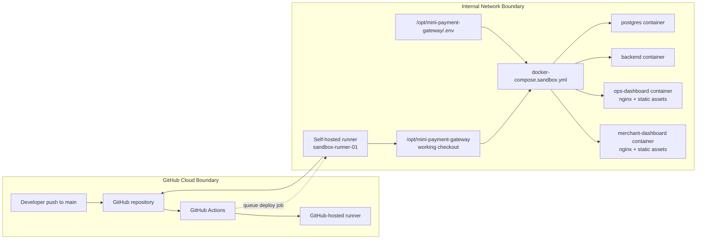
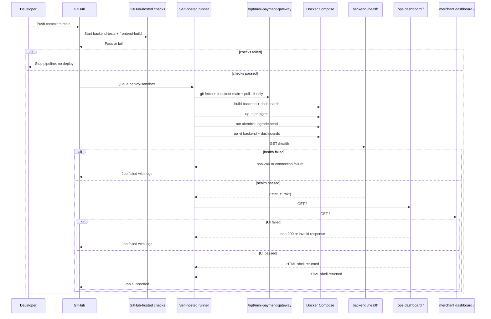

# DevOps Architecture

This document describes the current internal DevOps architecture for the
mini-payment-gateway sandbox environment after phase 10.

Use this document when you need to understand:

- why the sandbox CI/CD model was designed this way;
- which systems participate in build, deploy, and runtime;
- where trust boundaries and secrets live;
- how code moves from `main` to the running sandbox host;
- what the current operational and hardening limits are.

This is an internal sandbox architecture document, not a production platform
specification.

Related documents:

- `sandbox-setup-from-zero.md` - repeatable server setup from a fresh host
- `sandbox-deployment.md` - deploy and recovery runbook
- `docs/history/completions/phase-09.md` - phase 09 CI/CD rollout evidence
- `docs/history/completions/phase-10.md` - Ops dashboard rollout evidence

## Architecture Summary

The current design uses a split pipeline:

- GitHub-hosted Actions runners perform backend and frontend verification.
- A self-hosted GitHub Actions runner runs directly on the sandbox Ubuntu host.
- The sandbox host pulls `main` itself and deploys locally with Docker Compose.
- Database migrations run on-host before backend restart.
- The sandbox runtime includes the FastAPI backend, the internal Ops Dashboard,
  and the Merchant Dashboard.
- Deployment is accepted only if the backend `/health` endpoint, the Ops
  dashboard root, and the Merchant Dashboard root all pass.
- As of June 2, 2026, the live sandbox publishes PostgreSQL, backend, and both
  dashboards on `192.168.1.199` for internal LAN access when the bind addresses
  in `.env` are set to that LAN IP.

The key architectural choice is **internal pull deployment**:

- GitHub does not SSH into the sandbox host.
- The sandbox host initiates outbound HTTPS connections to GitHub.
- Deployment logic executes inside the internal network boundary.

This keeps the first sandbox topology simple and avoids:

- inbound firewall exposure for GitHub-to-server SSH;
- SSH key distribution through GitHub secrets;
- an extra internal CI jump host in the first rollout.

## Design Goals

- Keep the sandbox easy to reason about and easy to recover manually.
- Reuse normal developer primitives: `git`, Docker Compose, Alembic, `/health`.
- Require tests before deploy on every push to `main`.
- Minimize public attack surface for an internal environment.
- Keep the runtime state inspectable directly on the sandbox host.

## System Topology

Current live environment:

- Repository: `biabeogo147/mini-payment-gateway`
- Default deploy branch: `main`
- Sandbox host: `192.168.1.199` (`ubuntu24`)
- App checkout directory: `/opt/mini-payment-gateway`
- Runner user: `github-runner`
- Runner service:
  `actions.runner.biabeogo147-mini-payment-gateway.sandbox-runner-01.service`
- Runner labels: `self-hosted`, `linux`, `sandbox`, `deploy`

### Topology Diagram



### Component Roles

| Component | Role |
| --- | --- |
| GitHub repository | Source of truth for deployable application code on `main` |
| GitHub-hosted runner | Executes `backend-tests` and `frontend-build` before any deploy can happen |
| Self-hosted runner | Executes deploy job locally on the sandbox host |
| `/opt/mini-payment-gateway` | Persistent checkout used by both manual and automated deploys |
| `docker-compose.sandbox.yml` | Defines the sandbox runtime stack |
| `/opt/mini-payment-gateway/.env` | Holds server-local runtime configuration and secrets |
| `postgres` container | Sandbox database runtime |
| `backend` container | FastAPI application runtime |
| `ops-dashboard` container | Internal browser UI served by nginx and proxying `/api` to the backend |
| `merchant-dashboard` container | Merchant browser UI served by nginx and proxying `/api` to the backend |

## Trust Boundaries And Secret Flow

The system intentionally separates cloud CI verification from internal deploy
execution.

### Boundary Model

- GitHub is the external control plane for workflow orchestration.
- The Ubuntu sandbox host is the internal execution plane for deployment.
- The running application and database stay entirely on the sandbox host.

### Network Direction

- GitHub-hosted runners reach GitHub-managed infrastructure only.
- The self-hosted runner connects outbound to GitHub over HTTPS.
- No inbound SSH from GitHub to `192.168.1.199` is required.
- Internal clients on the same LAN can connect directly to:
  - `192.168.1.199:5432` for PostgreSQL
  - `192.168.1.199:8000` for the backend
  - `192.168.1.199:4173` for the Ops dashboard
  - `192.168.1.199:4174` for the Merchant Dashboard

### Secret Placement

- Application secrets stay on the sandbox host in
  `/opt/mini-payment-gateway/.env`.
- The deploy workflow does not require SSH secrets because the runner is
  installed directly on the target host.
- GitHub workflow permissions are limited to `contents: read` for this
  pipeline.

### Security Implications

- The runner is non-root, but membership in the `docker` group is privileged.
- Anyone who can execute arbitrary jobs on this runner effectively has strong
  control over the sandbox host.
- This is acceptable for the current internal sandbox, but it should be treated
  as a high-trust environment.

## Deployment Pipeline

The deployment pipeline is intentionally short and linear:

1. a change lands on `main`;
2. GitHub Actions runs backend verification and frontend dashboard builds;
3. only after test/build success is the deploy job eligible to run;
4. the self-hosted runner picks up the deploy job;
5. the host fast-forwards its local checkout to `origin/main`;
6. the host rebuilds and restarts the sandbox stack;
7. the deploy verifies backend health;
8. the deploy verifies the internal Ops Dashboard root;
9. the deploy verifies the Merchant Dashboard root;
10. the deploy is accepted only if all checks succeed.

### Pipeline Diagram



## Host Design

The sandbox host is both the deploy target and the self-hosted runner node.

### Runtime Layout

```text
/opt/mini-payment-gateway/
  .env
  .env.sandbox.example
  docker-compose.sandbox.yml
  apps/
    ops-dashboard/
    merchant-dashboard/
  deploy/
    sandbox_deploy.sh
  backend/
```

### Service Layout

- `github-runner` owns the runner files and app checkout.
- `docker` service provides container runtime for both manual and automated
  deploys.
- the GitHub runner service stays enabled through systemd.

### Why The Runner Lives On The Target Host

This was chosen because it gives the smallest viable internal CI/CD topology:

- no separate internal CI host to maintain;
- no extra LAN SSH hop;
- no duplicated deploy credentials;
- direct access to Docker, filesystem, and local health check.

The tradeoff is that the deploy runner is tightly coupled to the target host.
That is acceptable for a single internal sandbox, but less ideal for a larger
multi-environment platform.

## Deployment Mechanics

The deploy workflow entrypoint is
`.github/workflows/sandbox-deploy.yml`.

It has three jobs:

- `backend-tests`
- `frontend-build`
- `deploy-sandbox`

The deploy job runs this host-local model:

```bash
cd /opt/mini-payment-gateway
git fetch --prune origin main
git checkout main
git pull --ff-only origin main
bash deploy/sandbox_deploy.sh
```

The deploy script then performs:

```bash
docker compose -f docker-compose.sandbox.yml build backend ops-dashboard merchant-dashboard
docker compose -f docker-compose.sandbox.yml up -d postgres
docker compose -f docker-compose.sandbox.yml run --rm backend python -m alembic upgrade head
docker compose -f docker-compose.sandbox.yml up -d backend ops-dashboard merchant-dashboard
curl -fsS http://192.168.1.199:8000/health
curl -fsS http://192.168.1.199:4173/
curl -fsS http://192.168.1.199:4174/
```

### Why Build On Host

The current sandbox does not use a separate image registry promotion flow.
Instead, it builds directly on the target host because that:

- reduces moving parts for the first rollout;
- keeps local manual deploy and CI/CD deploy behavior aligned;
- makes troubleshooting easier for a small internal environment.

The tradeoff is slower deploys than a registry-based image promotion model.

## Failure Gates

The pipeline has three important control points.

### Gate 1: Test And Build Gate

- `backend-tests` must succeed first.
- `frontend-build` must succeed first.
- If tests or dashboard builds fail, deploy does not run.

### Gate 2: Fast-Forward Gate

- the server checkout must be able to `pull --ff-only`.
- If the host working tree is dirty or has conflicting untracked files, deploy
  fails before touching containers.

### Gate 3: Runtime Health Gate

- even if image build and migrations succeed, deploy is still considered failed
  until `/health` returns successfully and both dashboard roots respond.
- On failure, the deploy script prints compose status and recent backend,
  dashboard, and postgres logs.

## Operational Model

### Source Of Truth

- GitHub `main` is the deploy source of truth.
- The sandbox host is expected to fast-forward to `origin/main`.
- The long-term rollback model is to revert or fix on `main`, then redeploy.

### Normal Deploy

- merge or push to `main`;
- wait for `backend-tests` and `frontend-build`;
- allow `deploy-sandbox` to run on the self-hosted runner;
- verify `/health` and both dashboard roots.

### Manual Recovery Deploy

If GitHub Actions is unavailable or deeper inspection is needed, the same host
can be deployed manually:

```bash
cd /opt/mini-payment-gateway
bash deploy/sandbox_deploy.sh
```

This is intentional. The automated and manual deploy paths share the same host
checkout, compose file, and deploy script.

### Verification Commands

```bash
cd /opt/mini-payment-gateway
docker compose -f docker-compose.sandbox.yml ps
docker compose -f docker-compose.sandbox.yml logs --tail 100 backend
docker compose -f docker-compose.sandbox.yml logs --tail 100 postgres
curl -fsS http://192.168.1.199:8000/health
curl -fsS http://192.168.1.199:4173/
curl -fsS http://192.168.1.199:4174/
curl -fsS http://192.168.1.199:8000/v1/internal/auth/bootstrap-status
```

### Current Rollback Model

The current architecture does not implement blue/green or canary release.

Practical rollback today means:

- revert the bad change on `main` and let the workflow redeploy; or
- in an emergency, check out a known-good commit on the host and run the deploy
  script manually, understanding that the next successful deploy from `main`
  will move the host forward again.

The preferred path is the first one because it keeps GitHub `main` as the clear
source of truth.

## Design Tradeoffs

### Strengths

- Simple topology with very little glue code.
- No inbound SSH from GitHub.
- Shared manual and automated deploy path.
- Clear test-before-deploy control.
- Easy on-host troubleshooting because runtime state is local and visible.

### Weaknesses

- The target host is also the deploy runner host.
- Secrets are still file-based on the machine.
- Builds happen on the target host instead of from immutable promoted images.
- There is only one environment-specific deploy path today.

## Hardening Roadmap

The current architecture is correct for an internal sandbox, but it is not the
final production-grade DevOps shape.

Recommended next steps:

1. Move sandbox and future production secrets to a stronger secret management
   path.
2. Add GitHub Environment approval rules if deploys to `main` should require a
   human gate.
3. Introduce reverse proxy and TLS if the sandbox needs broader access.
4. Add monitoring, alerting, and log aggregation beyond on-host inspection.
5. Add backup and restore procedures for PostgreSQL.
6. Consider moving to registry-based image promotion if deploy frequency or
   environment count grows.
7. For multi-environment expansion, consider separating the runner host from
   the target host.

## Decision Record

Current accepted design decisions:

- direct self-hosted runner on the sandbox host;
- internal pull deployment instead of external SSH push;
- `main` as deploy source of truth;
- Docker Compose runtime on the target host;
- Alembic migration during deploy;
- health-gated completion;
- host-local `.env` for sandbox secrets.

Those decisions are intentional, documented, and consistent with the current
internal sandbox risk profile.
